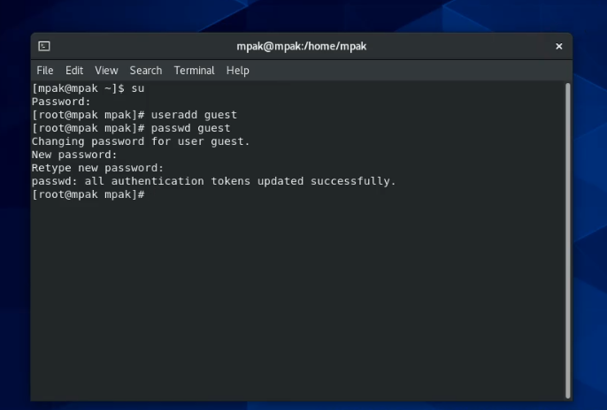
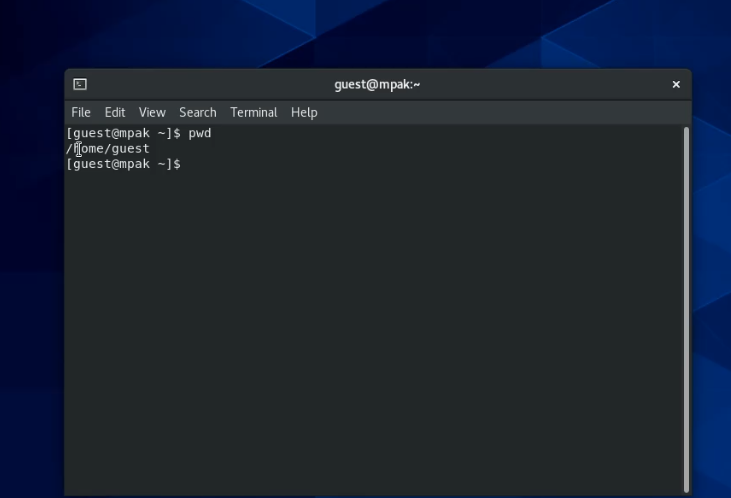
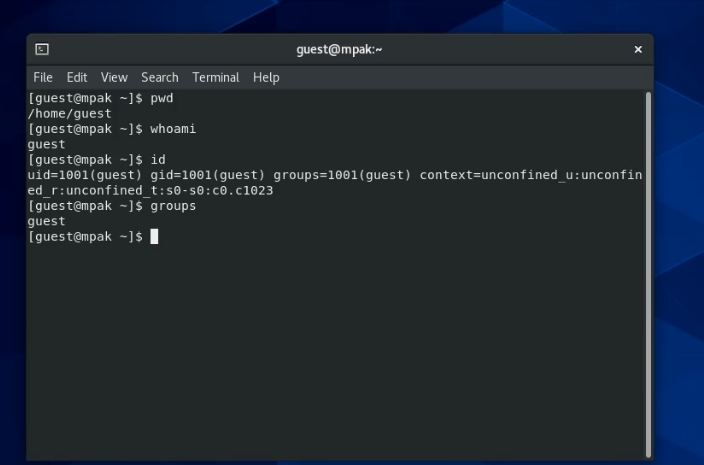
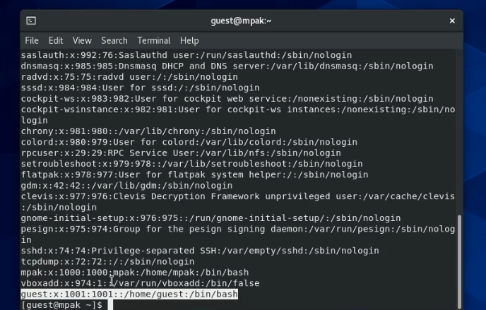
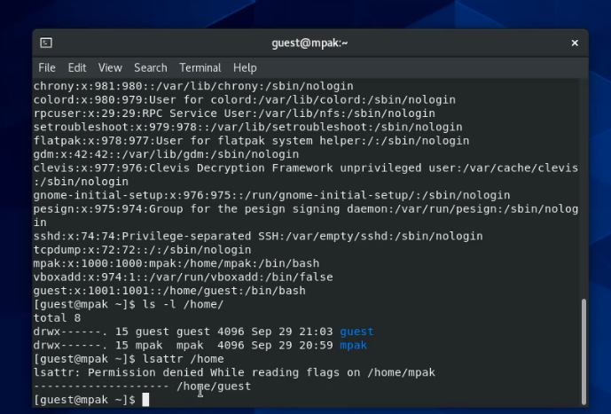
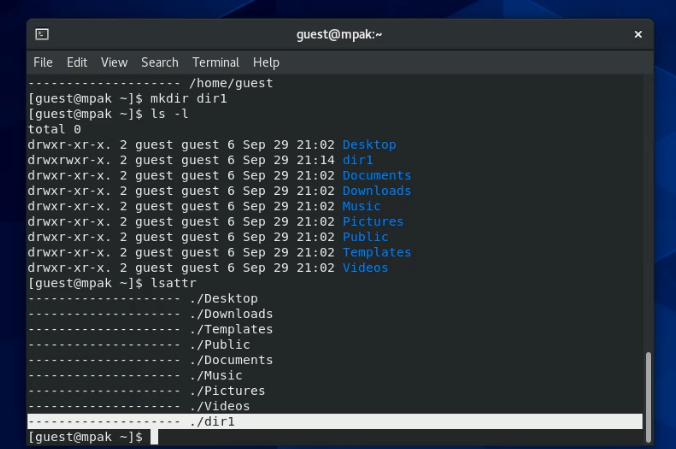
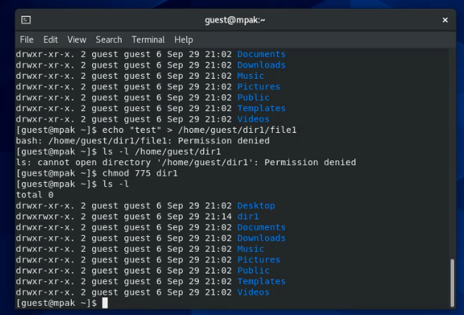
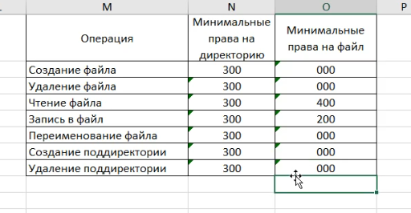

---
## Front matter
lang: ru-RU
title: Лабораторная работа №1
author: Пак Мария 
institute: RUDN University, Moscow, Russian Federation
date: 2021 Moscow, Russia

## Formatting
toc: false
slide_level: 2
theme: metropolis
header-includes: 
 - \metroset{progressbar=frametitle,sectionpage=progressbar,numbering=fraction}
 - '\makeatletter'
 - '\beamer@ignorenonframefalse'
 - '\makeatother'
aspectratio: 43
section-titles: true
---

# Презентация лабораторной работы №2
[TOC]

## Прагматика выполнения лабораторной работы

Студенты должны разбираться в работе с атрибутами файлов и директорий, а также знать как пользователи с разными правами доступа взаимодействуют с ними. Все это необходимо для глубоко погружения в в среду Centos и для повышения безопасности в системе.

## Цель выполнения лабораторной работы

Получение практических навыков работы в консоли с атрибутами файлов, закрепление теоретических основ дискреционного разграничения доступа в современных системах с открытым кодом на базе ОС Linux.

## Задачи выполнения лабораторной работы

1. В установленной при выполнении предыдущей лабораторной работы операционной системе создать учётную запись пользователя guest (использую учётную запись администратора): useradd guest

2. Задайть пароль для пользователя guest (использую учётную запись администратора): passwd guest

3. Войти в систему от имени пользователя guest.

4. Определить директорию, в которой вы находитесь, командой pwd. 

6. Уточните имя вашего пользователя, его группу, а также группы, куда входит пользователь, командой id. Выведенные значения uid, gid и др. запомните. Сравните вывод id с выводом команды groups.

7. Сравните полученную информацию об имени пользователя с данными, выводимыми в приглашении командной строки.

8. Просмотрите файл /etc/passwd командой cat /etc/passwd. Найдите в нём свою учётную запись. Определите uid пользователя. Определите gid пользователя. Сравните найденные значения с полученными в предыдущих пунктах.

9. Определите существующие в системе директории командой ls -l /home/

10. Проверьте, какие расширенные атрибуты установлены на поддиректориях, находящихся в директории /home, командой: lsattr /home

11. Создайте в домашней директории поддиректорию dir1 командой mkdir dir1

12. Снимите с директории dir1 все атрибуты командой chmod 000 dir1 и проверьте с её помощью правильность выполнения команды ls -l

13. Попытайтесь создать в директории dir1 файл file1 командой echo "test" > /home/guest/dir1/file1

14. Заполните таблицу «Установленные права и разрешённые действия».

15. На основании заполненной таблицы определите те или иные минимально необходимые права для выполнения операций внутри директории dir1, заполните табл. 2.2.

## Выполнение лабораторной работы

1. Создала новой учетной записи через аккаунт администратора  успешно.

2. Через новую учетную запись определила, в какой директории теперь будут храниться файлы.  Ей оказывается домашняя директория - home/guest. 

3. Командами id, groups, passwd, получила информацию о нашем новом аккаунте. Все команды выдают информацию, которая не различается.

4. Удалось получить список всех поддиректорий командой  ls -l /home/. Права установлены стандартные : полные права для владельца, чтение и исполнение для всех остальных. Атрибуты увидеть также удалось. Расширенные атрибуты других пользователей увидеть не удалось.

5. Создала в  домашней директории поддиректорию dir1 командой mkdir dir1. Права доступа на ней получились слудующие: полные права для владельца и группы, только исполнение и чтение для других.

12. Обнулила права на директорию dir1 все атрибуты командой chmod 000 dir1. Попытка создать в dir1 файл file1 командой echo "test" > /home/guest/dir1/file1 не удалась.  Файл в директории отсутсвует, что подтверждает успешную смену прав.

14. Заполнила таблицу «Установленные права и разрешённые действия».

15. На основании заполненной таблицы составила еще одну таблицу 2.

## Вывод

Приобретены практических навыки работы в консоли с атрибутами файлов. Закреплены теоретических основ дискреционного разграничения доступа в современных системах с открытым кодом на базе ОС Linux.

{.standout}

Спасибо за внимание 