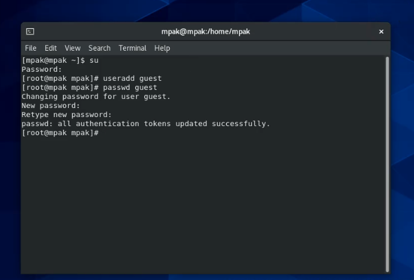

---
# Front matter
lang: ru-RU
title: "Лабораторная работа № 2"
subtitle: "Дискреционное
разграничение прав в Linux. Основные
атрибуты"
author: "Пак Мария НБибд-01-18 1032184261"

# Formatting
toc-title: "Содержание"
toc: true # Table of contents
toc_depth: 2
lof: true # List of figures
lot: true # List of tables
fontsize: 12pt
linestretch: 1.5
papersize: a4paper
documentclass: scrreprt
polyglossia-lang: russian
polyglossia-otherlangs: english
mainfont: PT Serif
romanfont: PT Serif
sansfont: PT Sans
monofont: PT Mono
mainfontoptions: Ligatures=TeX
romanfontoptions: Ligatures=TeX
sansfontoptions: Ligatures=TeX,Scale=MatchLowercase
monofontoptions: Scale=MatchLowercase
indent: true
pdf-engine: lualatex
header-includes:
  - \linepenalty=10 # the penalty added to the badness of each line within a paragraph (no associated penalty node) Increasing the value makes tex try to have fewer lines in the paragraph.
  - \interlinepenalty=0 # value of the penalty (node) added after each line of a paragraph.
  - \hyphenpenalty=50 # the penalty for line breaking at an automatically inserted hyphen
  - \exhyphenpenalty=50 # the penalty for line breaking at an explicit hyphen
  - \binoppenalty=700 # the penalty for breaking a line at a binary operator
  - \relpenalty=500 # the penalty for breaking a line at a relation
  - \clubpenalty=150 # extra penalty for breaking after first line of a paragraph
  - \widowpenalty=150 # extra penalty for breaking before last line of a paragraph
  - \displaywidowpenalty=50 # extra penalty for breaking before last line before a display math
  - \brokenpenalty=100 # extra penalty for page breaking after a hyphenated line
  - \predisplaypenalty=10000 # penalty for breaking before a display
  - \postdisplaypenalty=0 # penalty for breaking after a display
  - \floatingpenalty = 20000 # penalty for splitting an insertion (can only be split footnote in standard LaTeX)
  - \raggedbottom # or \flushbottom
  - \usepackage{float} # keep figures where there are in the text
  - \floatplacement{figure}{H} # keep figures where there are in the text
---

# Лабораторная работа №2

[TOC]

## Цель работы

Получение практических навыков работы в консоли с атрибутами файлов, закрепление теоретических основ дискреционного разграничения доступа в современных системах с открытым кодом на базе ОС Linux1.

## Задание

1. В установленной при выполнении предыдущей лабораторной работы операционной системе создайте учётную запись пользователя guest (использую учётную запись администратора): useradd guest

2. Задайте пароль для пользователя guest (использую учётную запись администратора): passwd guest

3. Войдите в систему от имени пользователя guest.

4. Определите директорию, в которой вы находитесь, командой pwd. Сравните её с приглашением командной строки. Определите, является ли она вашей домашней директорией? Если нет, зайдите в домашнюю директорию.

5. Уточните имя вашего пользователя командой whoami.

6. Уточните имя вашего пользователя, его группу, а также группы, куда входит пользователь, командой id. Выведенные значения uid, gid и др. запомните. Сравните вывод id с выводом команды groups.

7. Сравните полученную информацию об имени пользователя с данными, выводимыми в приглашении командной строки.

8. Просмотрите файл /etc/passwd командой cat /etc/passwd. Найдите в нём свою учётную запись. Определите uid пользователя. Определите gid пользователя. Сравните найденные значения с полученными в предыдущих пунктах.

9. Определите существующие в системе директории командой ls -l /home/

10. Проверьте, какие расширенные атрибуты установлены на поддиректориях, находящихся в директории /home, командой: lsattr /home

11. Создайте в домашней директории поддиректорию dir1 командой mkdir dir1

12. Снимите с директории dir1 все атрибуты командой chmod 000 dir1 и проверьте с её помощью правильность выполнения команды ls -l

13. Попытайтесь создать в директории dir1 файл file1 командой echo "test" > /home/guest/dir1/file1

14. Заполните таблицу «Установленные права и разрешённые действия».

15. На основании заполненной таблицы определите те или иные минимально необходимые права для выполнения операций внутри директории dir1, заполните табл. 2.2.

## Теоретическое введение

 операционной системе Linux есть много отличных функций безопасности, но она из самых важных - это система прав доступа к файлам. Linux, как последователь идеологии ядра Linux в отличие от Windows, изначально проектировался как многопользовательская система, поэтому права доступа к файлам в linux продуманы очень хорошо. И это очень важно, потому что локальный доступ к файлам для всех программ и всех пользователей позволил бы вирусам без проблем уничтожить систему. Существуют следующие виды прав:

Чтение - разрешает получать содержимое файла, но не на запись. Для каталога позволяет получить список файлов и каталогов, расположенных в нем;
Запись - разрешает записывать новые данные в файл или изменять существующие, а также позволяет создавать и изменять файлы и каталоги;
Выполнение - вы не можете выполнить программу, если у нее нет флага выполнения. Этот атрибут устанавливается для всех программ и скриптов, именно с помощью него система может понять, что этот файл нужно запускать как программу.

## Оборудование

Лабораторная работа выполнялась дома со следующими характеристиками техники: 

– Intel(R) Core(TM) i7-7700HQ CPU @ 2.80GHz 2.81GHz
– ОС Майкрософт Windows 10
– VirtualBox верс. 6.1.26

# Выполнение лабораторной работы

1. Захожу в Centos под учетной записи администратора. Через su даю себе доступ к root и создаю новую учетную запись.

2. Далее задала пароль для нашего новго пользователя.

3. Теперь вхожу в систему из созданной учетной записи.

4. Определяю директорию, в которой нахожусь. Ей оказывается домашняя директория - home/guest. Это и есть домашняя директория для нашего нового пользователя.

5. Командой whoami уточняю имя моего пользователя. Guest или не guest вот в чем вопрос?

6. Команда id выдает следующее. uid - 1001, gid - 1001, groups - 1001 и имя ползователя - guest. А команда groups выдает только значение guest. Данные сходяться, что радует.

7. У нас уже не осталось сомнений по поводу того, какой мы пользователь. Но мы же еще можем посмотреть на начало командной строки и увидеть, что мы все-таки guest. Мы как любой человек после 20, все еще находимся в поисках себя.

8. Смотрим файл passwd. Находим там себя (теперь то мы точно знаем, что мы guest). Все значения совпадают с теми, что выдавала команда id.

9. ls -l /home/ определяем существующие в системе директории. Удалось получить список всех поддиректорий, права установлен стандартные. Все права для владельца, чтение и исполнение для всех остальных. 

10. Смотрим, какие атрибуты установлены в файлах. Атрибуты увидеть удалось. Расширенные атрибуты других пользователей увидеть не удалось. Радуемся, что больше не надо смотреть, guest мы или не guest. 

11. Создаем в домашней директории поддиректорию dir1 командой mkdir dir1. Права доступа на ней получились слудующие: полные права для владельца и группы, только исполнение и чтение для других.

12. Снимаем с директории dir1 все атрибуты командой chmod 000 dir1 (чмод)))0)) и проверяем с её помощью правильность выполнения команды ls -l. Действительно, директория теперь имеет нулевые права для всех.

13. Попытались создать в директории dir1 файл file1 командой echo "test" > /home/guest/dir1/file1. Команде было отказано в доступе, а все это из-за отсутсвия у нас прав на это действие. Файл в директории отсутсвует.

14. Заполнила таблицу «Установленные права и разрешённые действия».

15. На основании заполненной таблицы составила еще одну таблицу 2.

## Выводы

 В ходе данной лабораторной работы мной были получены практические навыки работы в консоли с атрибутами файлов, а также я закрепила теоритические основы дискреционного разграничения прав в Линукс. Мной были определены возможности пользователя над директориями и файлами при разных правах доступа. Были созданы 2 таблицы.

## Список литературы 

1.CentOS // Википедия URL: https://ru.wikipedia.org/wiki/CentOS (дата обращения: 01.10.2021).

2.https://losst.ru/prava-dostupa-k-fajlam-v-linux (дата обращения: 01.10.2021).