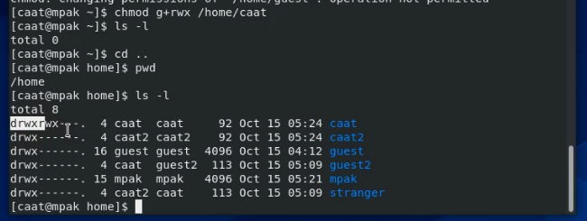

---
## Front matter
lang: ru-RU
title: Лабораторная работа №3
author: |
	Пак Мария  \inst{1}
	
institute: |
	\inst{1}RUDN University, Moscow, Russian Federation
	
date: 01.10.2021 Moscow, Russia

## Formatting
toc: false
slide_level: 2
theme: metropolis
header-includes: 
 - \metroset{progressbar=frametitle,sectionpage=progressbar,numbering=fraction}
 - '\makeatletter'
 - '\beamer@ignorenonframefalse'
 - '\makeatother'
aspectratio: 43
section-titles: true

---

## Прагматика выполнения лабораторной работы

Студенты должны разбираться в работе с атрибутами файлов и директорий, а также знать как пользователи с разными правами доступа взаимодействуют с ними. Все это необходимо для глубоко погружения в в среду Centos и для повышения безопасности в системе.

## Цель выполнения лабораторной работы

Получение практических навыков работы в консоли с атрибутами файлов, закрепление теоретических основ дискреционного разграничения доступа в современных системах с открытым кодом на базе ОС Linux.

## Задачи выполнения лабораторной работы

1. В установленной при выполнении предыдущей лабораторной работы операционной системе создать 2-х пользоватей.
2. Добавить одного пользователя в группу к другому 
3. Войти в два терминала от имени двух пользователей.
4.  Определить директорию командой pwd. Уточнить информаицю о пользователе  командами id, groups, cat /etc/group
5. От имени пользователя guest измените права директории /home/guest,
разрешив все действия для пользователей группы и создать каталог и файл в нем.
6. Заполнить таблицу «Установленные права и разрешённые действия для группы» Табл 3.1. Сравнить с таблицой из прошлой лабораторной работы.
7. Заполнить таблицу итог Табл 3.2. Сравнить с таблицей из лабораторной 2.

## Результаты выполнения лабораторной работы

1. Создала 2 новыу учетной записи через аккаунт администратора  успешно.(рис. -@fig:001).

{ #fig:001 width=70% }

## Результаты выполнения лабораторной работы

2. Добавила пользователя caat2 вгруппу к пользователю cat(рис. -@fig:002).

{ #fig:002 width=70% }  

## Результаты выполнения лабораторной работы

3. Открыла 2 терминала и через них вошла в новые учетные записи caat и caat2 (рис. -@fig:003).

{ #fig:003 width=70% } 

(рис. -@fig:004).

{ #fig:004 width=70% } 

## Результаты выполнения лабораторной работы

4. Командами id, groups, cat /etc/group, получила информацию о наших аккакунтах. Все команды выдают информацию, которая не различается.

(рис. -@fig:005). 

{ #fig:005 width=70% } 

(рис. -@fig:006). 

{ #fig:006 width=70% } 

## Результаты выполнения лабораторной работы

5. От имени пользователя сaat изменила права директории /home/caat,
разрешив все действия для пользователей группы. Создала у caat2  каталог dir1 и файл в нем. (рис. -@fig:007). 

{ #fig:007 width=70% } 

## Результаты выполнения лабораторной работы

6. Экспериментальным методом заполнила таблицу «Установленные права и разрешённые действия для группы» Табл 3.1. Сравнила с таблицой из прошлой лабораторной работы.(рис. -@fig:008).

{ #fig:008 width=70% } 
{ #fig:011 width=70% } 

## Результаты выполнения лабораторной работы

7. Заполнила таблицу 3.2 на основании выводов таблицы 3.1. Сравнить с таблицей из лабораторной 2.

{ #fig:009 width=70% } 
{ #fig:010 width=70% } 

## Вывод

Приобретены практических навыки работы в консоли с атрибутами файлов. Закреплены теоретических основ дискреционного разграничения доступа в современных системах с открытым кодом на базе ОС Linux.

## {.standout}

Спасибо за внимание 