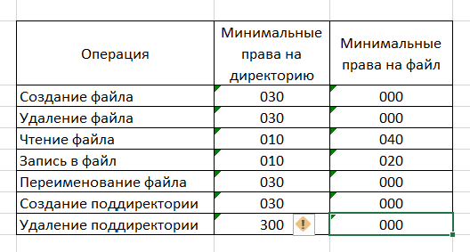

---
# Front matter
lang: ru-RU
title: "Лабораторная работа № 3"
subtitle: "Дискреционное разграничение прав в Linux. Два пользователя"
author: "Пак Мария НБИбд-01-18 1032184261"

# Formatting
toc-title: "Содержание"
toc: true # Table of contents
toc_depth: 2
lof: true # List of figures
lot: true # List of tables
fontsize: 12pt
linestretch: 1.5
papersize: a4paper
documentclass: scrreprt
polyglossia-lang: russian
polyglossia-otherlangs: english
mainfont: PT Serif
romanfont: PT Serif
sansfont: PT Sans
monofont: PT Mono
mainfontoptions: Ligatures=TeX
romanfontoptions: Ligatures=TeX
sansfontoptions: Ligatures=TeX,Scale=MatchLowercase
monofontoptions: Scale=MatchLowercase
indent: true
pdf-engine: lualatex
header-includes:
  - \linepenalty=10 # the penalty added to the badness of each line within a paragraph (no associated penalty node) Increasing the value makes tex try to have fewer lines in the paragraph.
  - \interlinepenalty=0 # value of the penalty (node) added after each line of a paragraph.
  - \hyphenpenalty=50 # the penalty for line breaking at an automatically inserted hyphen
  - \exhyphenpenalty=50 # the penalty for line breaking at an explicit hyphen
  - \binoppenalty=700 # the penalty for breaking a line at a binary operator
  - \relpenalty=500 # the penalty for breaking a line at a relation
  - \clubpenalty=150 # extra penalty for breaking after first line of a paragraph
  - \widowpenalty=150 # extra penalty for breaking before last line of a paragraph
  - \displaywidowpenalty=50 # extra penalty for breaking before last line before a display math
  - \brokenpenalty=100 # extra penalty for page breaking after a hyphenated line
  - \predisplaypenalty=10000 # penalty for breaking before a display
  - \postdisplaypenalty=0 # penalty for breaking after a display
  - \floatingpenalty = 20000 # penalty for splitting an insertion (can only be split footnote in standard LaTeX)
  - \raggedbottom # or \flushbottom
  - \usepackage{float} # keep figures where there are in the text
  - \floatplacement{figure}{H} # keep figures where there are in the text

---

# Лабораторная работа №2

[TOC]

## Цель работы

Получение практических навыков работы в консоли с атрибутами фай-
лов для групп пользователей.

## Задание

1. В установленной при выполнении предыдущей лабораторной работы операционной системе создайте учётную запись пользователя guest (использую учётную запись администратора): useradd guest

2. Задайте пароль для пользователя guest (использую учётную запись администратора): passwd guest

3. Аналогично создайте второго пользователя guest2.

4. Добавьте пользователя guest2 в группу guest: gpasswd -a guest2 guest

5. Осуществите вход в систему от двух пользователей на двух разных кон-
солях: guest на первой консоли и guest2 на второй консоли.

6. Для обоих пользователей командой pwd определите директорию, в кото-
рой вы находитесь. Сравните её с приглашениями командной строки.

7. Уточните имя вашего пользователя, его группу, кто входит в неё
и к каким группам принадлежит он сам. Определите командами
groups guest и groups guest2, в какие группы входят пользовате-
ли guest и guest2. Сравните вывод команды groups с выводом команд
id -Gn и id -G.

8. Сравните полученную информацию с содержимым файла /etc/group.
Просмотрите файл командой cat /etc/group

9. От имени пользователя guest2 выполните регистрацию пользователя
guest2 в группе guest командой
newgrp guest

10. От имени пользователя guest измените права директории /home/guest,
разрешив все действия для пользователей группы:
chmod g+rwx /home/guest

11. От имени пользователя guest снимите с директории /home/guest/dir1
все атрибуты командой chmod 000 dirl и проверьте правильность снятия атрибутов. Меняя атрибуты у директории dir1 и файла file1 от имени пользова-
теля guest и делая проверку от пользователя guest2, заполните табл. 3.1,
определив опытным путём, какие операции разрешены, а какие нет. Ес-
ли операция разрешена, занесите в таблицу знак «+», если не разрешена,
знак «-».

12. Сравните табл. 2.1 (из лабораторной работы № 2) и табл. 3.1.
На основании заполненной таблицы определите те или иные минималь-
но необходимые права для выполнения пользователем guest2 операций
внутри директории dir1 и заполните табл. 3.2.

## Теоретическое введение

В операционной системе Linux есть много отличных функций безопасности, но она из самых важных - это система прав доступа к файлам. Linux, как последователь идеологии ядра Linux в отличие от Windows, изначально проектировался как многопользовательская система, поэтому права доступа к файлам в linux продуманы очень хорошо. И это очень важно, потому что локальный доступ к файлам для всех программ и всех пользователей позволил бы вирусам без проблем уничтожить систему [[1]](## Список литературы).

Существуют следующие виды прав:

Чтение - разрешает получать содержимое файла, но не на запись. Для каталога позволяет получить список файлов и каталогов, расположенных в нем; [[2]](## Список литературы)

Запись - разрешает записывать новые данные в файл или изменять существующие, а также позволяет создавать и изменять файлы и каталоги; [[2]](## Список литературы)

Выполнение - вы не можете выполнить программу, если у нее нет флага выполнения. Этот атрибут устанавливается для всех программ и скриптов, именно с помощью него система может понять, что этот файл нужно запускать как программу. [[2]](## Список литературы)

## Оборудование

Лабораторная работа выполнялась дома со следующими характеристиками техники: 

– Intel(R) Core(TM) i7-7700HQ CPU @ 2.80GHz 2.81GHz
– ОС Майкрософт Windows 10
– VirtualBox верс. 6.1.26

# Выполнение лабораторной работы

1. Захожу в Centos под учетной записи администратора. Через su даю себе доступ к root и создаю новую учетную запись. 
(рис. -@fig:001)
{ #fig:001 width=70% }

2. Далее задала пароль для нашего новго пользователя.

3. Точно также создаем нашего второго пользователя.

4. Добавляем второго созданного пользователя в группу к первому новому пользователю.

5. Открываем вторую консоль и входим в двух консолях под разными созданными учетными записями двух пользователей.

6. Для двух пользователей определяем, в кокй директории они находятся. обы пользователя находятсяв домашних директориях, что подтверждает начало командной строки.

7. Командами groups guest и groups guest2 смотрим, в какие группы входят пользователи. Сравните вывод команды groups с выводом командid -Gn и id -G.

8. Сравниваем полученную информацию с содержимым файла /etc/group. Видим, что пользователь caat2 входит в группу к пользователю caat. Что является полследвием команды ранее введенной.

9. Еще раз от имени пользователя от имени пользователя caat2 выполните регистрацию пользователя caat в группе.

10. От имени пользователя caat изменяем права директории /home/guest,
разрешив все действия для пользователей группы.

11. От имени пользователя caat снимаем с директории dir1 все атрибуты. Заполнила табл. 3.1. Если операция разрешена - знак «+», если не разрешена - знак «-». Сравнила табл. 2.1 (из лабораторной работы № 2) и табл. 3.1.

12.  На основании заполненной таблицы заполнила табл. 3.2.

На основании всех таблиц, мы можем сказать, что в прошлой работе у пользователя была возможность менять атрибу файлам. В этот раз, когда пользователь состоящий в группе пытается поменять права не своего файла, то сделать это просто не возможно.

## Выводы

 В ходе данной лабораторной работы мной были получены практические навыки работы в консоли с атрибутами файлов, а также я закрепила теоритические основы дискреционного разграничения прав в Линукс. Мной были определены возможности пользователя над директориями и файлами при разных правах доступа. Были созданы 2 таблицы и проведено сравнени ес результатми прошлой работы.

## Список литературы 

1.CentOS // Википедия URL: https://ru.wikipedia.org/wiki/CentOS (дата обращения: 15.10.2021).

2.https://losst.ru/prava-dostupa-k-fajlam-v-linux (дата обращения: 15.10.2021).

