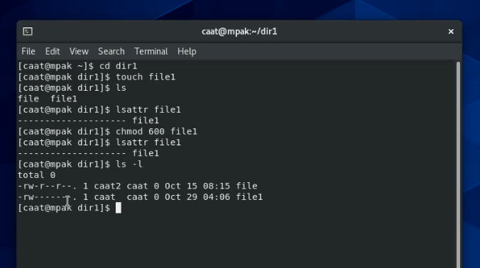
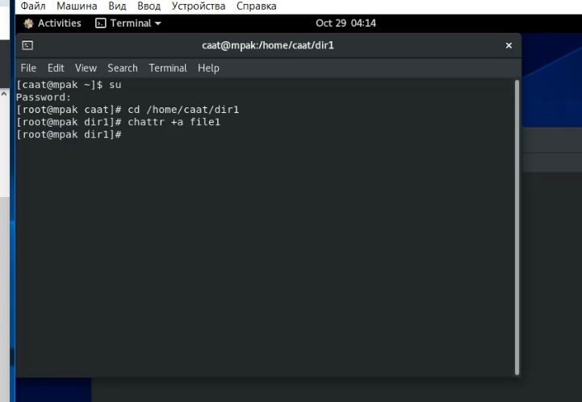
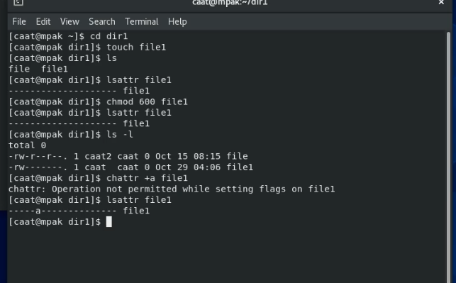
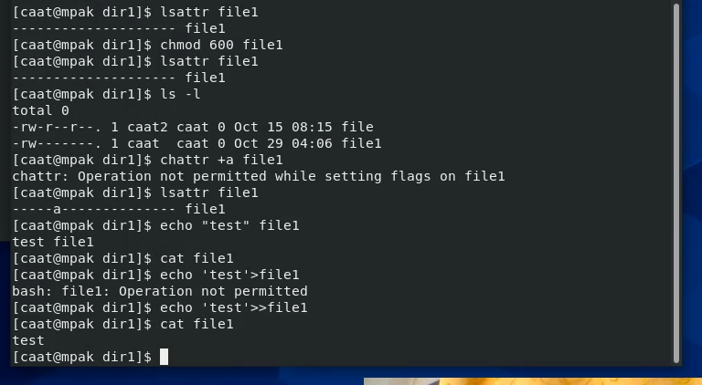
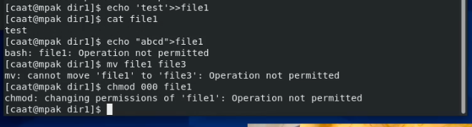
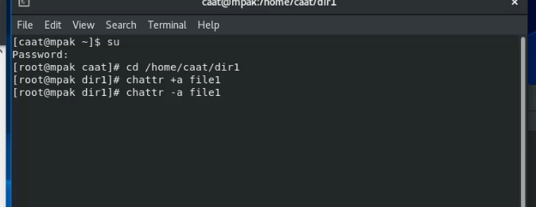
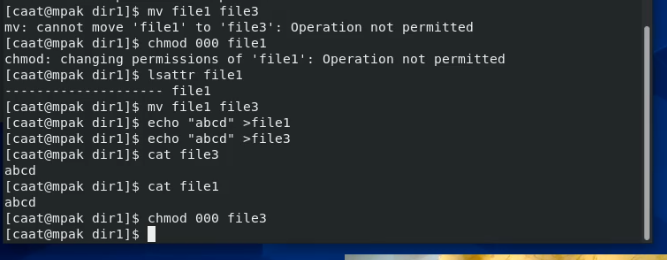
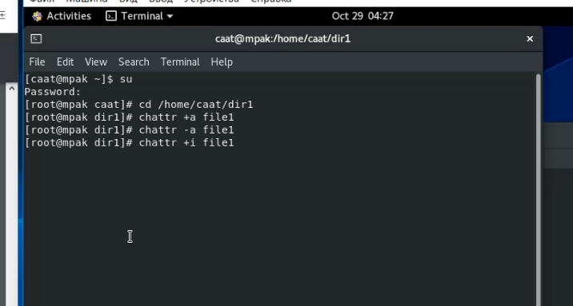
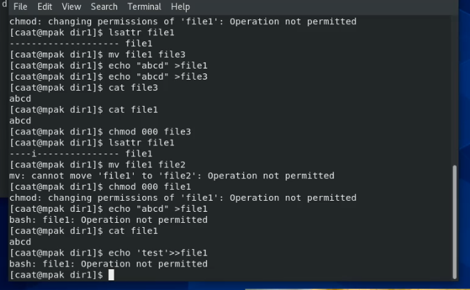

---
## Front matter
lang: ru-RU
title: Лабораторная работа №4
author: |
	Пак Мария  \inst{1}
	
institute: |
	\inst{1}RUDN University, Moscow, Russian Federation
	
date: 01.10.2021 Moscow, Russia

## Formatting
toc: false
slide_level: 2
theme: metropolis
header-includes: 
 - \metroset{progressbar=frametitle,sectionpage=progressbar,numbering=fraction}
 - '\makeatletter'
 - '\beamer@ignorenonframefalse'
 - '\makeatother'
aspectratio: 43
section-titles: true

---

## Прагматика выполнения лабораторной работы

Студенты должны разбираться в работе с атрибутами файлов и директорий, а также знать как пользователи с разными правами доступа взаимодействуют с ними. Все это необходимо для глубоко погружения в в среду Centos и для повышения безопасности в системе.

## Цель выполнения лабораторной работы

Получение практических навыков работы в консоли с расширенными атрибутами файлов, закрепление теоретических основ дискреционного разграничения доступа в современных системах с открытым кодом на базе ОС Linux.

## Задачи выполнения лабораторной работы

1. От имени пользователя guest определите расширенные атрибуты файла file1 и установить права, разрешающие чтение и запись для владельца файла.

2. Зайти через администратора и установить расширенный атрибут a на файл file1 от имени суперпользователя: chattr +a /home/guest/dir1/file1

3. Выполнить дозапись в файл file1 слова «test» командой echo "test". Убедиться, что слово test было успешно записано в file1.

4. Попробовать перезаписать имеющуюся в файле информацию. Попробовать переименовать файл. С помощью команды chmod 000 file1 установить на файл file1 права запрещающие чтение и запись для владельца файла. 

5. Повторите операции, которые ранее не удавалось выполнить, но без атрибута -a у файла. 

6. Повторить действия по шагам, заменив атрибут «a» атрибутом «i». 

## Результаты выполнения лабораторной работы

1. Создала новый файл file1. Просмотрела расширенные атрибуты и поменяла права доступа к файлу: разрешила чтение и запись для владельца файла(рис. -@fig:001).

{ #fig:001 width=70% }

## Результаты выполнения лабораторной работы

2. Зала во второй терминал с правами su. Установить расширенный атрибут a на файл file1 от имени суперпользователя. Расширенные права установились успешно - посмотрела через пользователя caat (рис. -@fig:002) (рис. -@fig:003).

{ #fig:002 width=70% }  

{ #fig:003 width=70% }  

## Результаты выполнения лабораторной работы

3. Выполнила дозапись в файл file1 слова «test» командой echo "test". Слово test успешно записано в file1(рис. -@fig:004). 

{ #fig:004 width=70% } 

## Результаты выполнения лабораторной работы

4. Попробовала перезаписать имеющуюся в файле информацию. Попробовала переименовать файл. Попыталась установить на файл file1 права запрещающие чтение и запись для владельца файла. Все три операции не выполнились - отказ в правах доступа.

(рис. -@fig:005). 

{ #fig:005 width=70% }  

## Результаты выполнения лабораторной работы

5. Сняла расширенный атрибут с файла. Повторила операции, которые ранее не удавалось выполнить, но без атрибута -a у файла. Операции перезаписи, переименования и изменения прав прошли успешно.  (рис. -@fig:007). 

{ #fig:007 width=70% } 

(рис. -@fig:006)

{ #fig:006 width=70% } 

Расширенный атрибут  -а дает возможность только дозаписывать текст в файлы, но никак больше их изменять нельзя. А также нельзя удалить.

## Результаты выполнения лабораторной работы

6. Добавила атрибут i через консоль с root.  Повторила действия по шагам. Операции записи, дозапись, удаления, переименования файла, а также изменение прав файла невозможны.

   (рис. -@fig:008)  

   (рис. -@fig:011) 

{ #fig:008 width=70% } 

{ #fig:011 width=70% } 

Расширенный атрибут i, как и атрибут a не разрешает изменять файл. Только а атрибут давал нам возможность дозаписывать файл, а i блокирует все возможные изменения, делая файл неизменяемым.

## Результаты выполнения лабораторной работы

## Вывод

Приобретены практических навыки работы в консоли с раширенными атрибутами файлов. Закреплены теоретических основ дискреционного разграничения доступа в современных системах с открытым кодом на базе ОС Linux.

## {.standout}

Спасибо за внимание 