---
# Front matter 
lang: ru-RU
title: "Лабораторная работа № 4"
subtitle: "Дискреционное разграничение прав в Linux. Расширенные
атрибуты"
author: "Пак Мария НБИбд-01-18 1032184261"

# Formatting
toc-title: "Содержание"
toc: true # Table of contents
toc_depth: 2
lof: true # List of figures
lot: true # List of tables
fontsize: 12pt
linestretch: 1.5
papersize: a4paper
documentclass: scrreprt
polyglossia-lang: russian
polyglossia-otherlangs: english
mainfont: PT Serif
romanfont: PT Serif
sansfont: PT Sans
monofont: PT Mono
mainfontoptions: Ligatures=TeX
romanfontoptions: Ligatures=TeX
sansfontoptions: Ligatures=TeX,Scale=MatchLowercase
monofontoptions: Scale=MatchLowercase
indent: true
pdf-engine: lualatex
header-includes:
  - \linepenalty=10 # the penalty added to the badness of each line within a paragraph (no associated penalty node) Increasing the value makes tex try to have fewer lines in the paragraph.
  - \interlinepenalty=0 # value of the penalty (node) added after each line of a paragraph.
  - \hyphenpenalty=50 # the penalty for line breaking at an automatically inserted hyphen
  - \exhyphenpenalty=50 # the penalty for line breaking at an explicit hyphen
  - \binoppenalty=700 # the penalty for breaking a line at a binary operator
  - \relpenalty=500 # the penalty for breaking a line at a relation
  - \clubpenalty=150 # extra penalty for breaking after first line of a paragraph
  - \widowpenalty=150 # extra penalty for breaking before last line of a paragraph
  - \displaywidowpenalty=50 # extra penalty for breaking before last line before a display math
  - \brokenpenalty=100 # extra penalty for page breaking after a hyphenated line
  - \predisplaypenalty=10000 # penalty for breaking before a display
  - \postdisplaypenalty=0 # penalty for breaking after a display
  - \floatingpenalty = 20000 # penalty for splitting an insertion (can only be split footnote in standard LaTeX)
  - \raggedbottom # or \flushbottom
  - \usepackage{float} # keep figures where there are in the text
  - \floatplacement{figure}{H} # keep figures where there are in the text

---

# Лабораторная работа №3

[TOC]

## Цель работы

Получение практических навыков работы в консоли с атрибутами фай-
лов для групп пользователей.

## Задание

1. От имени пользователя guest определите расширенные атрибуты файла
/home/guest/dir1/file1 командой lsattr /home/guest/dir1/file1

2. Установите командой chmod 600 file1 на файл file1 права, разрешающие чтение и запись для владельца файла.

3. Попробуйте установить на файл /home/guest/dir1/file1 расширенный атрибут a от имени пользователя guest: chattr +a /home/guest/dir1/file1. В ответ вы должны получить отказ от выполнения операции.

4. Зайдите на третью консоль с правами администратора либо повысьте
свои права с помощью команды su. Попробуйте установить расширенный атрибут a на файл /home/guest/dir1/file1 от имени суперпользователя:
chattr +a /home/guest/dir1/file1

5. От пользователя guest проверьте правильность установления атрибута:
lsattr /home/guest/dir1/file1

6. Выполните дозапись в файл file1 слова «test» командой echo "test" /home/guest/dir1/file1. После этого выполните чтение файла file1 командой cat /home/guest/dir1/file1. Убедитесь, что слово test было успешно записано в file1.

7. Попробуйте удалить файл file1 либо стереть имеющуюся в нём информацию командой echo "abcd" > /home/guest/dirl/file1
Попробуйте переименовать файл.

8. Попробуйте с помощью командыchmod 000 file1 установить на файл file1 права, например, запрещающие чтение и запись для владельца файла. Удалось ли вам успешно выполнить указанные команды?

9. Снимите расширенный атрибут a с файла /home/guest/dirl/file1 от имени суперпользователя командой chattr -a /home/guest/dir1/file1. Повторите операции, которые вам ранее не удавалось выполнить. Ваши наблюдения занесите в отчёт.

10. Повторите ваши действия по шагам, заменив атрибут «a» атрибутом «i». Удалось ли вам дозаписать информацию в файл? Ваши наблюдения занесите в отчёт.

## Теоретическое введение

В операционной системе Linux есть много отличных функций безопасности, но она из самых важных - это система прав доступа к файлам. Linux, как последователь идеологии ядра Linux в отличие от Windows, изначально проектировался как многопользовательская система, поэтому права доступа к файлам в linux продуманы очень хорошо. И это очень важно, потому что локальный доступ к файлам для всех программ и всех пользователей позволил бы вирусам без проблем уничтожить систему [[1]](## Список литературы).

Расширенные атрибуты представляют собой пары имя: значение, которые постоянно связаны с файлами и каталогами, подобно тому как строки окружения связаны с процессом. Атрибут может быть определён или не определён. Если он определён, то его значение может быть или пустым, или не пустым [[2]](## Список литературы).

Формат символьного режима: +-=acdeijstuACDST [[3]](## Список литературы).

«+» обозначает добавление указанных атрибутов к существующим;  [[2]](## Список литературы)
«-» обозначает их снятие; 
«=» обозначает установку только этих атрибутов файлам. 

Символы «acdeijstuACDST» указывают на новые атрибуты файлов, некоторые атрибуты может назначить только суперпользователь (root):

- Не обновлять время последнего доступа к файлу atime (A) 
- Использовать синхронное обновление (S)
- Использовать синхронное обновление каталогов (D)
- Только добавление к файлу (a)
- Сжатый (c)
- Не архивировать (d)
- Неизменяемый (i)
- Безопасное удаление (s)
- Вершина иерархического дерева (T)
- Запрет слияния в конце файла (t)
- Неудаляемый (u)
- Нет копирования при записи (C)
- Журналирование данных (j)
- extent format (e) 
[[3]](## Список литературы).

## Оборудование

Лабораторная работа выполнялась дома со следующими характеристиками техники: 

– Intel(R) Core(TM) i7-7700HQ CPU @ 2.80GHz 2.81GHz
– ОС Майкрософт Windows 10
– VirtualBox верс. 6.1.26

# Выполнение лабораторной работы

1. Захожу в учетную запись от имени пользователя caat. Создаю новый файл file1 в папке dir1. Определяю имени расширенные атрибуты файла file1 командой
lsattr file1. Как видно, расширенных атрибутов  у файла никаких нет.

(рис. -@fig:001)
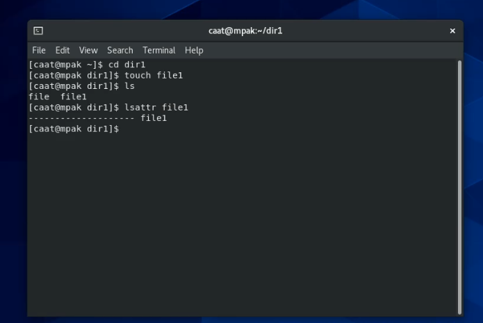{ #fig:001 width=70% }

2. Установила командой chmod 600 file1 на файл file1 права, разрешающие чтение и запись для владельца файла caat. Права установились успешно.

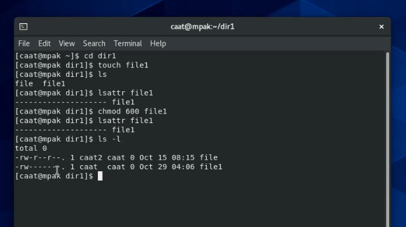

3. Попробую установить на файл file1 расширенный атрибут a от имени пользователя caat: chattr +a file1. В ответ получаю отказ в операции, как и должно было быть.

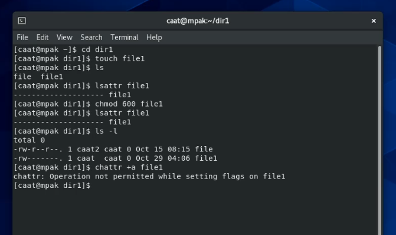

4. Открываю новую консоль, где захожу в root с командой  su.  Устанавливаю расширенный атрибут a на файл file1 от имени суперпользователя:
chattr +a file1

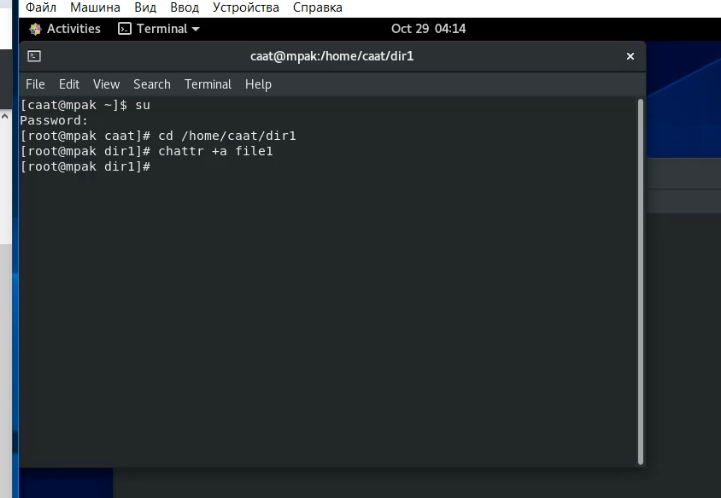

5. От пользователя caat  проверяю правильность установления атрибута:
lsattr file1. Действительно, теперь у файла стоит расширенный атрибут a.

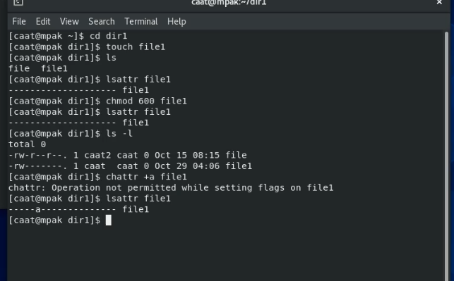

6. Выполнила дополнительную запись текста в файл file1 слова «test» командой echo "test" file1. После этого выполните чтение файла file1 командой cat file1. Слово было успешно записано.

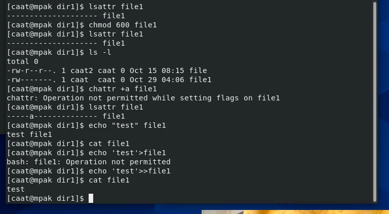

7. Попробую перезаписать файл echo "abcd" > file1. В перезаписи мне было отказано.

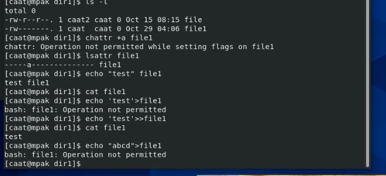

Попробую переименовать файл. В переименовании тоже было отказано.

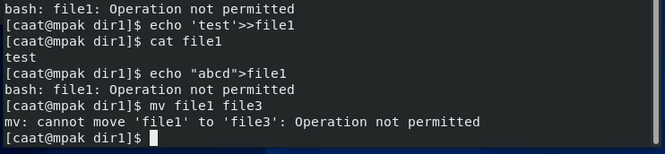

8. Попробую командой chmod 000 file1 установить на файл file1 права запрещающие чтение и запись для владельца файла. Эта команда тоже была не выполнена.

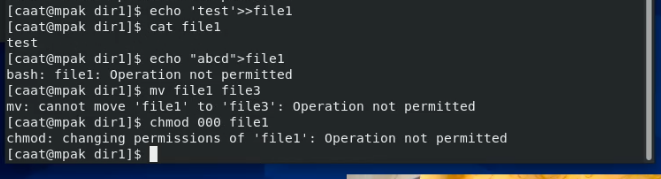

9. В консоли с правами root снимаю расширенный атрибут a с файла file1 от имени суперпользователя командой chattr -a file1. 

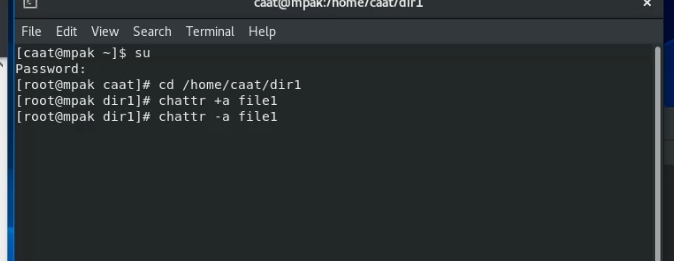

Повторяю операции, которые ранее не удавалось выполнить. После снятия расширенного атрибута a, снова появилась возможность переименовывать, перезаписывать файлы, а также менять их права доступа. Это все потому что расширенные права +a при установке дают возможность только на добавление записей к файлу.

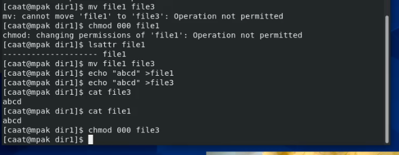

10. Повторяю ваши действия по шагам, заменив атрибут «a» атрибутом «i». Теперь стало невозможным дозаписывать информацию, как это было при атрибуте +а. Невозможно переименовать, дозаписать, стереть файл и изменить ему прова доступа.  Все потому что расширенный атрибут i делает файл неизменяемым, поэтому наши операции не проходили. 

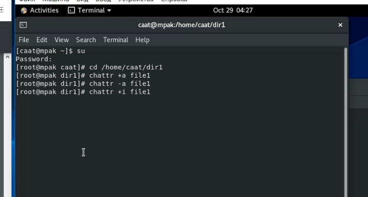
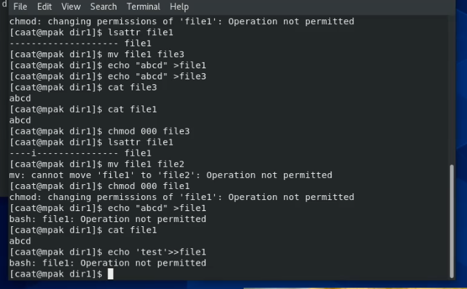

## Выводы
В результате выполнения работы я повысила свои навыки использования интерфейса командой строки (CLI), познакомилась на примерах с тем, как используются основные и расширенные атрибуты при разграничении доступа. Имела возможность связать теорию дискреционного разделения доступа (дискреционная политика безопасности) с её реализацией на практике в ОС Linux. Составили наглядные таблицы, поясняющие какие операции возможны при тех или иных установленных правах. Опробовала действие на практике расширенных атрибутов «а» и «i».

## Список литературы 

1.CentOS // Википедия URL: https://ru.wikipedia.org/wiki/CentOS (дата обращения: 15.10.2021).

2.Права Доступа // LoST // https://losst.ru/prava-dostupa-k-fajlam-v-linux (дата обращения: 15.10.2021).

3.Расширенные Атрибуты // linux-nites URL: https://linux-notes.org/izmenenie-atributov-flagov-na-fajlah-v-unix-linux/ (дата обращения: 28.10.2021).

