---
## Front matter
lang: ru-RU
title: Лабораторная работа №5
author: |
	Пак Мария  \inst{1}
	
institute: |
	\inst{1}RUDN University, Moscow, Russian Federation
	
date: 01.10.2021 Moscow, Russia

## Formatting
toc: false
slide_level: 2
theme: metropolis
header-includes: 
 - \metroset{progressbar=frametitle,sectionpage=progressbar,numbering=fraction}
 - '\makeatletter'
 - '\beamer@ignorenonframefalse'
 - '\makeatother'
aspectratio: 43
section-titles: true

---

## Прагматика выполнения лабораторной работы

Студенты должны разбираться в работе с атрибутами файлов и директорий, а также знать как пользователи с разными правами доступа взаимодействуют с ними. Все это необходимо для глубоко погружения в в среду Centos и для повышения безопасности в системе.

## Цель выполнения лабораторной работы

Изучение механизмов изменения идентификаторов, применения
SetUID- и Sticky-битов. Получение практических навыков работы в консоли с дополнительными атрибутами. Рассмотрение работы механизма смены идентификатора процессов пользователей, а также влияние бита Sticky на запись и удаление файлов.

## Задачи выполнения лабораторной работы

1. Создать программу simpleid.c, скомпилировать и исполнить. Сравнить результат вывода программы с командой id.
2. Создать программу simpleid2.c, где добавить вывод действительных идентификаторов. Скомпилировать программу и исполнить. Сравнить результат вывода программы с командой id.
3. Изменить владельца скомпилированного файла simpleid2 на root и поставить атрибут u+s на этот файл. Запустить файл  simpleid2 и сравнить с выводом id.
4. Установить SetGid-бит на файл simpleid2. Повторить прошлый пункт.
5. Создать программу readfile.c, откомпилировать. Поменять владельца у файла readfile.c на root, и поменять атрибуты так, чтобы пользователь сaat не мог прочитать файл readfile.c.
6. Сменить у файла readfile владельца и установить u+s. Проверить может ли программа readfile прочитать файл readfile.c. Проверьте, может ли программа readfile прочитать файл /etc/shadow.
7. Создать файл  file01.txt в директории /tmp. Провести серию операций с файлом, где  проверить возможность атрибута t, который стоит на директории tmp.
8. Снять атрибут t с каталога tmp и повторили все операции с фалом file01.txt из предыдущего пункта.

## Результаты выполнения лабораторной работы

1. Создала программу simpleid.c, скомпилировала.

(рис. -@fig:002)
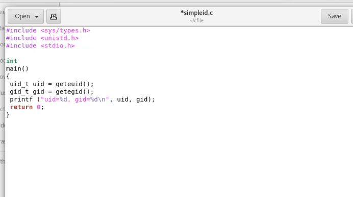{ #fig:002 width=70% }

Выполнила программу ./simpleid и id. Результаты они вывели одинаковые, так как обе программы просто выводят id пользователя, которому принадлежит файл и id группы файла.
(рис. -@fig:004)
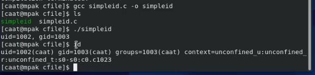{ #fig:004 width=70% }

## Результаты выполнения лабораторной работы

2. Создала программу simpleid2.c, где добавила вывод действительных идентификаторов. Скомпилировала программу и исполнила. 
(рис. -@fig:005)
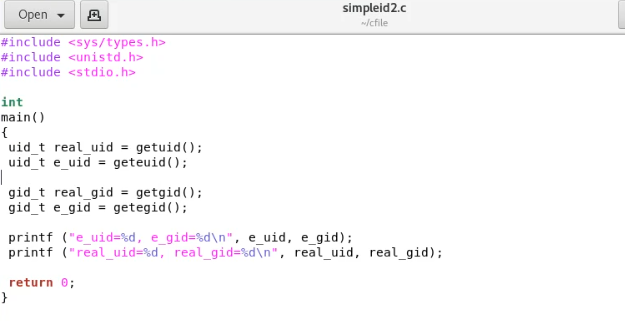{ #fig:005 width=100% }
(рис. -@fig:006)
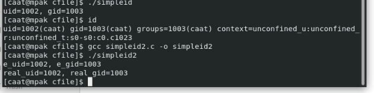{ #fig:006 width=100% }

## Результаты выполнения лабораторной работы

3. Изменила владельца скомпилированного файла simpleid2 на root и поставить атрибут u+s на этот файл.

(рис. -@fig:009)
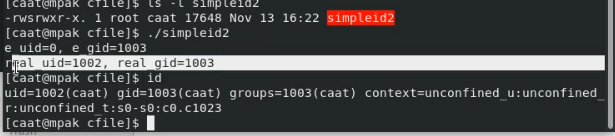{ #fig:009 width=100% }

e_uid показывает какие права пользователя использует программа. Программа пользуется правами суперюзера (думает, что программу запустил root). Это значение поменялось относительно псоленднего запуска, т.к. мы добавили права u+s. Тоже самое и с e_gid
real_uid указывает фактического пользователя, который запустил процесс. Запустил его caat. Тоже самое и с real_gid
id показывает те же самые результаты, только нигде не показывает информацию о правах суперюзера.

## Результаты выполнения лабораторной работы

4. Установила SetGid-бит на файл simpleid2.

(рис. -@fig:011)
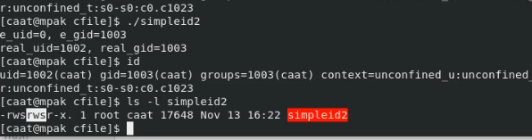{ #fig:011 width=100% } 

Как можно увидеть на последней картинке, у файла действительно утсановились права g+s, поэтому теперь на месте X можно увидеть S
Команды снова вывели одинаковую непротиворечащую информацию.

## Результаты выполнения лабораторной работы

5. Создала программу readfile.c, откомпилировала. Поменяла владельца у файла readfile.c на root, и поменяла атрибуты так, чтобы пользователь сaat не мог прочитать файл readfile.c.

(рис. -@fig:012)
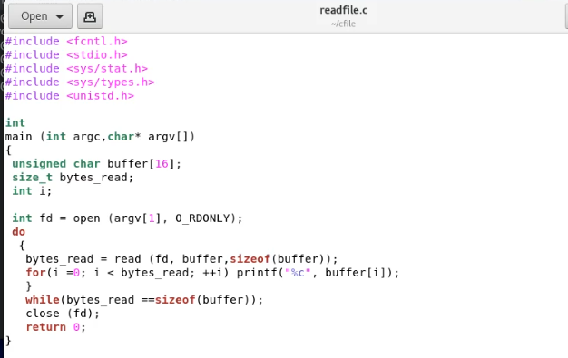{ #fig:012 width=100% }

(рис. -@fig:014)
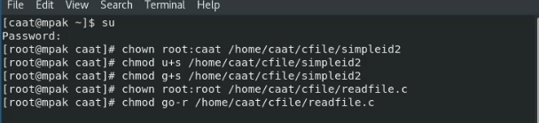{ #fig:014 width=100% }

(рис. -@fig:015)
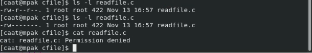{ #fig:015 width=100% }
Теперь только пользователь root может читать этот файл, а пользователь сaat получает отказ в операции чтение.

## Результаты выполнения лабораторной работы

6. Сменила у файла readfile владельца и установить u+s. Проверила может ли программа readfile прочитать файл readfile.c. Проверила, может ли программа readfile прочитать файл /etc/shadow.

(рис. -@fig:016)
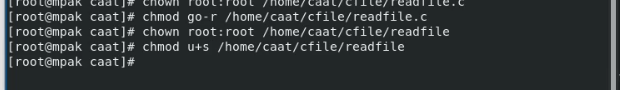{ #fig:016 width=100% }

(рис. -@fig:017)
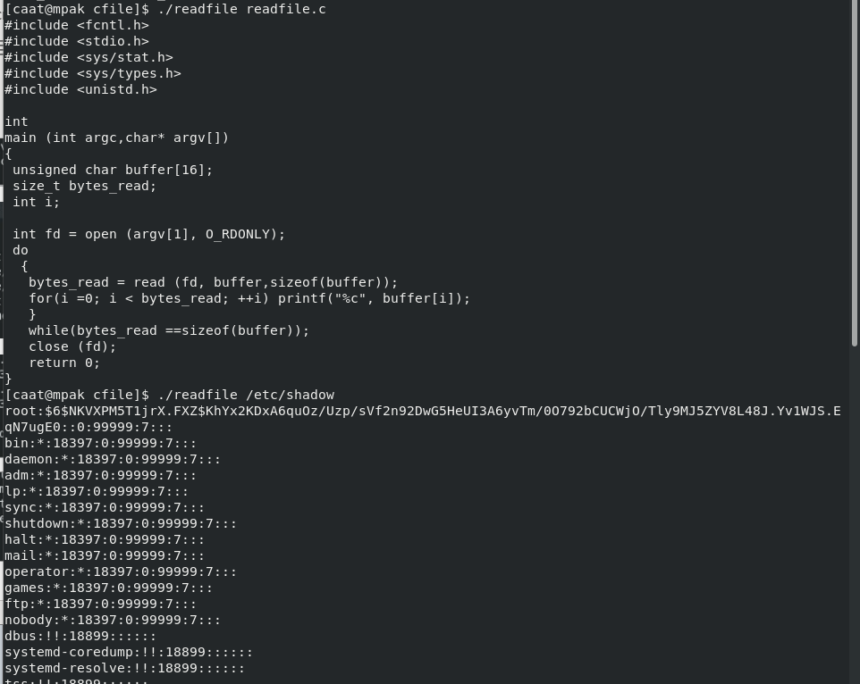{ #fig:017 width=100% }

Так как мы дали нашему исполняемому файлу особый атрибут S, теперь этот файл будет пользоваться правами суперюзера. На несколько пунктов до этого мы изменили обладателя файла readfile.c, т.е теперь его может читать только root. Так как наш скрипт readfile пользовался правами суперюзера, он и мог прочитать нужный нам файл readfile.c. Тоже самой и произошло с /etc/shadow, так как проводить операции с ним может только суперюзер.  

## Результаты выполнения лабораторной работы

7. Создала файл  file01.txt в директории /tmp. Провела серию операций с файлом, где  проверяла возможность атрибута t, который стоит на директории tmp.

(рис. -@fig:020)
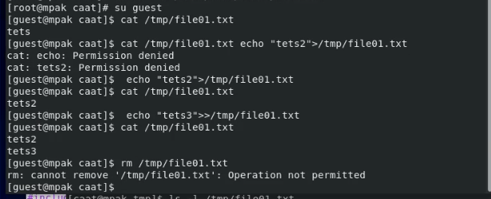{ #fig:020 width=100% }
Чтение файла работает.
Дозапись в файл работает.
Дозапись в файл со стиранием предыдущей информации - работает
Файл не удалить удалось.

## Результаты выполнения лабораторной работы

8. Сняла атрибут t с каталога tmp и повторила все операции с файлом file01.txt из предыдущего пункта.

(рис. -@fig:022)
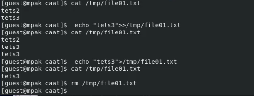{ #fig:022 width=100% }

Чтение файла работает.
Дозапись в файл работает.
Дозапись в файл со стиранием предыдущей информации - работает
Файл удалить удалось.

## Результаты выполнения лабораторной работы

## Вывод

Изучила механизм изменения идентификаторов, применения SetUID- и Sticky-битов. Получила практические навыки работы в консоли с дополнительными атрибутами. Рассмотрела работу механизма смены идентификатора процессов пользователей, а также влияние бита Sticky на запись и удаление файлов.

## {.standout}

Спасибо за внимание 