---
# Front matter 
lang: ru-RU
title: "Лабораторная работа № 5"
subtitle: "Дискреционное разграничение прав в Linux. Исследование влияния дополнительных атрибутов"
author: "Пак Мария НБИбд-01-18 1032184261"

# Formatting
toc-title: "Содержание"
toc: true # Table of contents
toc_depth: 2
lof: true # List of figures
lot: true # List of tables
fontsize: 12pt
linestretch: 1.5
papersize: a4paper
documentclass: scrreprt
polyglossia-lang: russian
polyglossia-otherlangs: english
mainfont: PT Serif
romanfont: PT Serif
sansfont: PT Sans
monofont: PT Mono
mainfontoptions: Ligatures=TeX
romanfontoptions: Ligatures=TeX
sansfontoptions: Ligatures=TeX,Scale=MatchLowercase
monofontoptions: Scale=MatchLowercase
indent: true
pdf-engine: lualatex
header-includes:
  - \linepenalty=10 # the penalty added to the badness of each line within a paragraph (no associated penalty node) Increasing the value makes tex try to have fewer lines in the paragraph.
  - \interlinepenalty=0 # value of the penalty (node) added after each line of a paragraph.
  - \hyphenpenalty=50 # the penalty for line breaking at an automatically inserted hyphen
  - \exhyphenpenalty=50 # the penalty for line breaking at an explicit hyphen
  - \binoppenalty=700 # the penalty for breaking a line at a binary operator
  - \relpenalty=500 # the penalty for breaking a line at a relation
  - \clubpenalty=150 # extra penalty for breaking after first line of a paragraph
  - \widowpenalty=150 # extra penalty for breaking before last line of a paragraph
  - \displaywidowpenalty=50 # extra penalty for breaking before last line before a display math
  - \brokenpenalty=100 # extra penalty for page breaking after a hyphenated line
  - \predisplaypenalty=10000 # penalty for breaking before a display
  - \postdisplaypenalty=0 # penalty for breaking after a display
  - \floatingpenalty = 20000 # penalty for splitting an insertion (can only be split footnote in standard LaTeX)
  - \raggedbottom # or \flushbottom
  - \usepackage{float} # keep figures where there are in the text
  - \floatplacement{figure}{H} # keep figures where there are in the text

---

# Лабораторная работа №5

[TOC]

## Цель работы
Изучение механизмов изменения идентификаторов, применения
SetUID- и Sticky-битов. Получение практических навыков работы в консоли с дополнительными атрибутами. Рассмотрение работы механизма
смены идентификатора процессов пользователей, а также влияние бита
Sticky на запись и удаление файлов.

## Задание
### Часть 1

1. Войдите в систему от имени пользователя guest.

2. Создайте программу simpleid.c.

3. Скомпилируйте программу и убедитесь, что файл программы создан:
gcc simpleid.c -o simpleid

4. Выполните программу simpleid: ./simpleid

5. Выполните системную программу id: id и сравните полученный вами результат с данными предыдущего пункта задания.

6. Усложните программу, добавив вывод действительных идентификаторов. Получившуюся программу назовите simpleid2.c.

7. Скомпилируйте и запустите simpleid2.c: gcc simpleid2.c -o simpleid2    ./simpleid2

8. От имени суперпользователя выполните команды: 
chown root:guest /home/guest/simpleid2
chmod u+s /home/guest/simpleid2

9. Используйте sudo или повысьте временно свои права с помощью su. Поясните, что делают эти команды.

10. Выполните проверку правильности установки новых атрибутов и смены владельца файла simpleid2: ls -l simpleid2

11. Запустите simpleid2 и id: ./simpleid2   и   id. Сравните результаты.

12. Проделайте тоже самое относительно SetGID-бита.

13. Создайте программу readfile.c:

14. Откомпилируйте её. gcc readfile.c -o readfile

15. Смените владельца у файла readfile.c (или любого другого текстового файла в системе) и измените права так, чтобы только суперпользователь (root) мог прочитать его, a guest не мог.

16. Проверьте, что пользователь guest не может прочитать файл readfile.c.

17. Смените у программы readfile владельца и установите SetU’D-бит.

18. Проверьте, может ли программа readfile прочитать файл readfile.c?

19. Проверьте, может ли программа readfile прочитать файл /etc/shadow?
Отразите полученный результат и ваши объяснения в отчёте.

### Часть 2

1. Выясните, установлен ли атрибут Sticky на директории /tmp, для чего
выполните команду ls -l / | grep tmp

2. От имени пользователя guest создайте файл file01.txt в директории /tmp со словом test: echo "test" > /tmp/file01.txt

3. Просмотрите атрибуты у только что созданного файла и разрешите чтение и запись для категории пользователей «все остальные»:
ls -l /tmp/file01.txt
chmod o+rw /tmp/file01.txt
ls -l /tmp/file01.txt

4. От пользователя guest2 (не являющегося владельцем) попробуйте прочитать файл /tmp/file01.txt: cat /tmp/file01.txt

5. От пользователя guest2 попробуйте дозаписать в файл /tmp/file01.txt слово test2 командой echo "test2" > /tmp/file01.txt . Удалось ли вам выполнить операцию?

6. Проверьте содержимое файла командой
cat /tmp/file01.txt

7. От пользователя guest2 попробуйте записать в файл /tmp/file01.txt   слово test3, стерев при этом всю имеющуюся в файле информацию командой echo "test3" > /tmp/file01.txt. Удалось ли вам выполнить операцию?

8. Проверьте содержимое файла командой cat /tmp/file01.txt

9. От пользователя guest2 попробуйте удалить файл /tmp/file01.txt командой
rm /tmp/fileOl.txt. Удалось ли вам удалить файл?

10. Повысьте свои права до суперпользователя следующей командой su -
и выполните после этого команду, снимающую атрибут t (Sticky-бит) с директории /tmp: chmod -t /tmp

11. Покиньте режим суперпользователя командой exit

12. От пользователя guest2 проверьте, что атрибута t у директории /tmp нет: ls -l / | grep tmp

13. Повторите предыдущие шаги. Какие наблюдаются изменения?

14. Удалось ли вам удалить файл от имени пользователя, не являющегося
его владельцем? Ваши наблюдения занесите в отчёт.

15. Повысьте свои права до суперпользователя и верните атрибут t на директорию /tmp: su -,  chmod +t /tmp, exit

## Теоретическое введение

В операционной системе Linux есть много отличных функций безопасности, но она из самых важных - это система прав доступа к файлам. Linux, как последователь идеологии ядра Linux в отличие от Windows, изначально проектировался как многопользовательская система, поэтому права доступа к файлам в linux продуманы очень хорошо. И это очень важно, потому что локальный доступ к файлам для всех программ и всех пользователей позволил бы вирусам без проблем уничтожить систему [[1]](## Список литературы).

Расширенные атрибуты представляют собой пары имя: значение, которые постоянно связаны с файлами и каталогами, подобно тому как строки окружения связаны с процессом. Атрибут может быть определён или не определён. Если он определён, то его значение может быть или пустым, или не пустым [[2]](## Список литературы).

Формат символьного режима: +-=acdeijstuACDST [[3]](## Список литературы).

«+» обозначает добавление указанных атрибутов к существующим;  [[2]](## Список литературы)
«-» обозначает их снятие; 
«=» обозначает установку только этих атрибутов файлам. 

Символы «acdeijstuACDST» указывают на новые атрибуты файлов, некоторые атрибуты может назначить только суперпользователь (root): [[3]](## Список литературы).

SUID - (сокращения от англ. set user ID upon execution — «установка ID пользователя во время выполнения) являются флагами прав доступа в Unix, которые разрешают пользователям запускать исполняемые файлы с правами владельца исполняемого файла. Иногда файлы требуют разрешения на выполнение для пользователей, которые не являются членами группы владельца, в этом случае вам потребуется предоставить специальные разрешения на выполнение. Когда SUID установлен, пользователь может запускать любую программу, такую как владелец программы.[[4]](## Список литературы).

chmod u+s {filename}

GUID - (сокращения от англ. set group ID upon execution — «установка ID группы во время выполнения») являются флагами прав доступа в Unix, которые разрешают пользователям запускать исполняемые файлы с правами группы исполняемого файла.[[4]](## Список литературы).

chmod g+s {filename}

Так же, как SUID , установив SGID бит для файла он устанавливает ваш идентификатор группы для группы файла в то время как файл выполняется. Это действительно полезно в случае когда у вас есть реальные установки в многопользовательском режиме где у пользователей есть доступ к файлом. В одной домашней категории я действительно не нашел использования для SGID. Но основная концепция является такой же, как и у SUID, файлы у которых SGID бит устанавливается, то они принадлежат к этой группе , а не к этому пользователю.[[4]](## Список литературы).

Sticky Bit используется в основном для каталогов, чтобы защитить в них файлы. Из такого каталога пользователь может удалить только те файлы, владельцем которых он является. Примером может служить каталог /tmp, в который запись открыта для всех пользователей, но нежелательно удаление чужих файлов.[[5]](## Список литературы).

chmod  +t {filename}

## Оборудование

Лабораторная работа выполнялась дома со следующими характеристиками техники: 

– Intel(R) Core(TM) i7-7700HQ CPU @ 2.80GHz 2.81GHz
– ОС Майкрософт Windows 10
– VirtualBox верс. 6.1.26

# Выполнение лабораторной работы
## Часть 1

1. Вошла в систему от имени пользователя caat. Даю себе прова root и отключаю систему запретов. Проверяю данный факт, и выхожу из режима суперпользователя. 

(рис. -@fig:001)
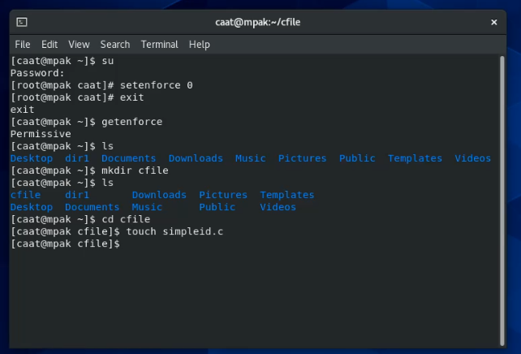{ #fig:001 width=70% }

2. Cоздаю файл simpleid.с и пишу в нем программу по образцу из лабораторной работы 5.

(рис. -@fig:002)
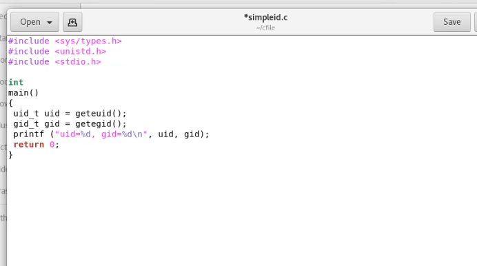{ #fig:002 width=70% }

3. Скомпилировала программу и убедилась, что файл программы создан. Как видно, теперь у нас есть исполняемый файл simleid, который подсвечивается зеленым.

(рис. -@fig:003)
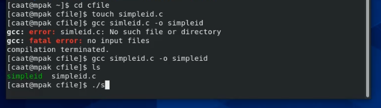{ #fig:003 width=70% }

4-5. Выполнила программу ./simpleid и id. Результаты они вывели одинаковые, так как обе программы просто выводят id пользователя, которому принадлежит файл и id группы файла.

(рис. -@fig:004)
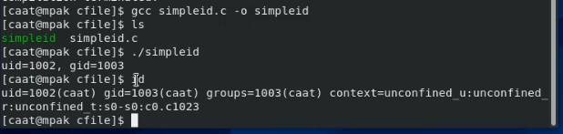{ #fig:004 width=70% }

6. Создала новый файл simpleid2.c.,  добавив вывод действительных идентификаторов. 

(рис. -@fig:005)
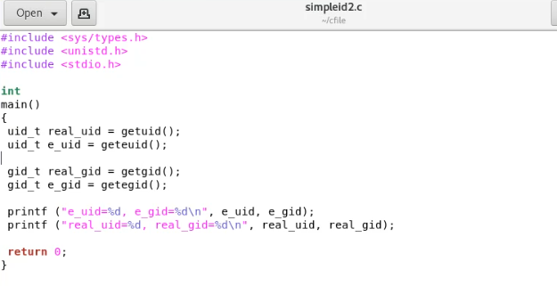{ #fig:005 width=100% }

7. Скомпилировала и запустите simpleid2.c.

(рис. -@fig:006)
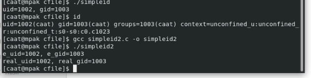{ #fig:006 width=100% }

8-9. От имени суперпользователя выполнила команды:  chown root:caat simpleid2 и  chmod u+s simpleid2
(рис. -@fig:007)
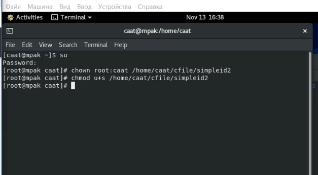{ #fig:007 width=100% }

Первая команда меняет владельца файла simpleid2.c на root, а группа у файла теперь caat. Т. е теперь владельцем файла является суперпользователь, а запускать его смогут и суперпользователь и группа caat.
Втора команда устанавливает дополнительное право UID. Теперь все кто запускают файл на время работы файла получают права владельца этого самого файла. Т.е. если программа считывает права пользователя для работы, то программа будет видеть, что у пользователя который ее запустил теперь права root.

10. Выполнила проверку правильности установки новых атрибутов и смены владельца файла simpleid2: ls -l simpleid2

(рис. -@fig:008)
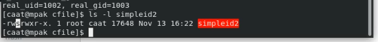{ #fig:008 width=100% }

Как видно на картинке, в атрибутах у владельца на месте X теперь появила буква S. Также команда показывает что пользователь root теперь владелец файла, а группа у файла caat.

11. Запустила simpleid2 и id: ./simpleid2   и   id. 

(рис. -@fig:009)
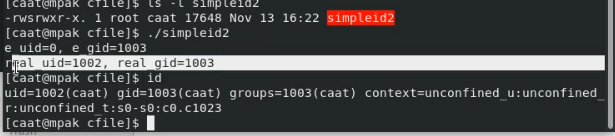{ #fig:009 width=100% }

e_uid показывает какие права пользователя использует программа. Программа пользуется правами суперюзера (думает, что программу запустил root). Это значение поменялось относительно псоленднего запуска, т.к. мы добавили права u+s. Тоже самое и с e_gid
real_uid указывает фактического пользователя, который запустил процесс. Запустил его caat. Тоже самое и с real_gid
id показывает те же самые результаты, только нигде не показывает информацию о правах суперюзера.

12. Проделала тоже самое относительно SetGID-бита. Т.е установила на файл права g+s. 
Запустила файл и команду id. Команды снова вывели одинаковую непротиворечащую информацию.
(рис. -@fig:010)
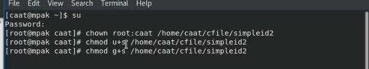{ #fig:010 width=100% }
(рис. -@fig:011)
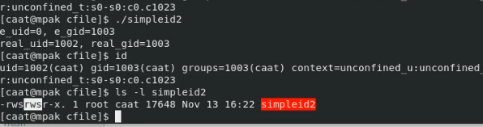{ #fig:011 width=100% }
Как можно увидеть на последней картинке, у файла действительно утсановились права g+s, поэтому теперь на месте X можно увидеть S

13-14. Создала программу readfile.c. Откомпилировала её. gcc readfile.c -o readfile
(рис. -@fig:012)
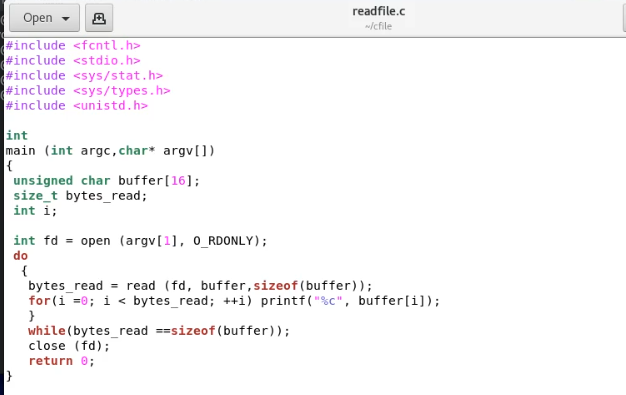{ #fig:012 width=100% }
(рис. -@fig:013)
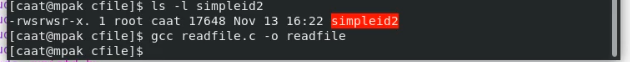{ #fig:013 width=100% }

15-16. Сменила владельца у файла readfile.c командой chown root:root и изменила права у файла. 

(рис. -@fig:014)
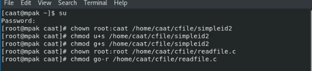{ #fig:014 width=100% }
(рис. -@fig:015)
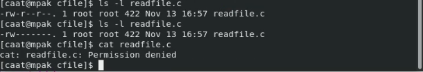{ #fig:015 width=100% }

Теперь только пользователь root может читать этот файл, а пользователь сaat получает отказ в операции чтение.

17-19. Сменила у программы readfile владельца и установите SetU’D-бит.
(рис. -@fig:016)
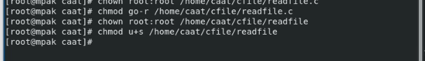{ #fig:016 width=100% }

На нижнем слайде мы видим как программа читает файл readfile.c, а затем и /etc/shadow. 
(рис. -@fig:017)
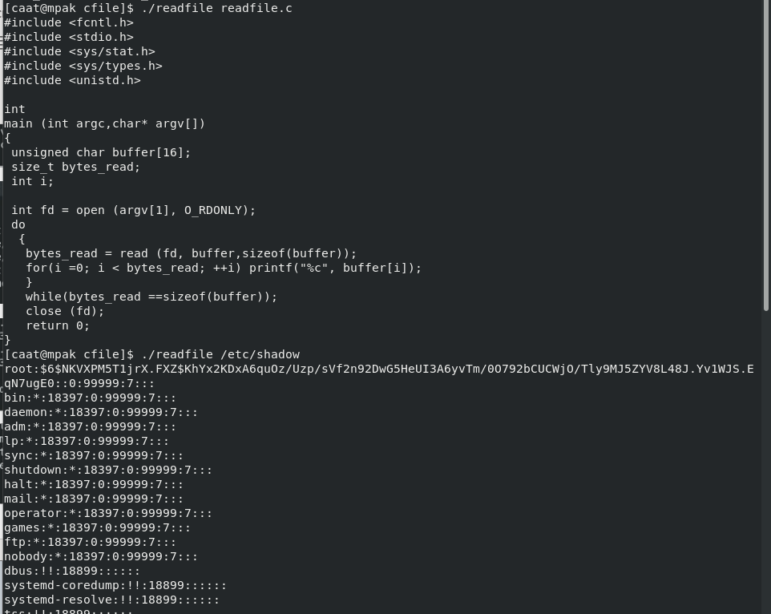{ #fig:017 width=100% }

Так как мы дали нашему исползныемум файлу особый атрибут S, теперь этот файл будет пользоваться правами суперюзера. На несколь пунктов до этого мы изменили обладателя файла readfile.c, т.е теперь его может читать только root. Так как наш скрипт readfile пользовался правами суперюзера, он и мог прочитать нужный нам файл readfile.c. Тоже самой и произошло с /etc/shadow, так как проводить операции с ним может только суперюзер.  

## Часть 2
1. Выясняем, установлен ли атрибут Sticky на директории /tmp, для чего выполнила команду ls -l / | grep tmp
(рис. -@fig:018)
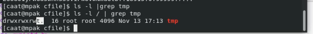{ #fig:018 width=100% }
Атрибут t действительно установлен на папке tmp. Она защищена от передвижения и удаления из директори, так как она является системной директорией.

2-3. От имени пользователя сaat создала файл file01.txt в директории /tmp со словом test.

(рис. -@fig:019)
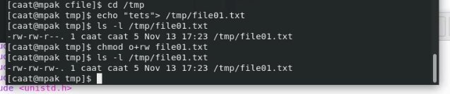{ #fig:019 width=100% }

Далее посмотрела атрибуты у только что созданного файла (не было разрешения на запись для "всех остальных") и разрешила чтение и запись для категории пользователей «все остальные». Атрибуты установаились правильно. Теперь у всех груп пользователей есть права на чтение и запись в файл.

4-9. От пользователя caat (не являющегося владельцем и не состоящем в общей группе) попробую прочитать файл cat /tmp/file01.txt. Файл спокойно читается.

(рис. -@fig:020)
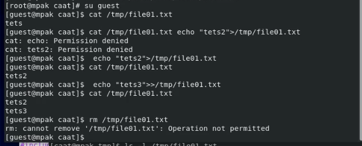{ #fig:020 width=100% }

Попробовала перезаписать слово test3, стерев при этом всю имеющуюся в файле информацию командой echo "test2" > /tmp/file01.txt. Эта операция удалась.

Попробую дозаписать в файл /tmp/file01.txt слово test2 командой echo "test2" >> /tmp/file01.txt . Дозаписать удалось.

Попробовала удалить файл /tmp/file01.txt командой rm /tmp/fileOl.txt. Файл удалить не удалось.

10-12. Повысила свои права до суперпользователя и сняла атрибут t (Sticky-бит) с директории /tmp. Покинула режим суперпользователя командой exit.

(рис. -@fig:021)
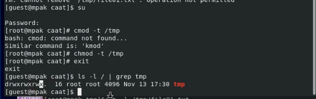{ #fig:021 width=100% }

От пользователя caat проверила, что атрибут снялся у директории. Его действительно теперь нет, а на его месте X у группы "все остальные".

13-14. Повторяю предыдущие действия без атрибута t.

(рис. -@fig:022)
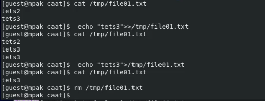{ #fig:022 width=100% }

Чтение файла работает.
Дозапись в файл работает.
Дозапись в файл со стиранием предыдущей информации - работает
Файл удалить удалось.

Это связано с тем, что атрибут t до этого предотвращал передвигание и удаление файлов из директории tmp. Как только мы сняли атрибут, удаление файла стало возможным.

15. Повыла свои права до суперпользователя и вернила атрибут t на директорию /tmp.

(рис. -@fig:023)
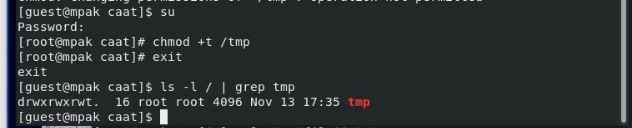{ #fig:023 width=100% }

Не забыла выйти из режима суперпользователя.

## Выводы
Изучила механизм изменения идентификаторов, применения SetUID- и Sticky-битов. Получила практические навыки работы в консоли с дополнительными атрибутами. Рассмотрела работу механизма смены идентификатора процессов пользователей, а также влияние бита Sticky на запись и удаление файлов.

## Список литературы 

1.CentOS // Википедия URL: https://ru.wikipedia.org/wiki/CentOS (дата обращения: 10.11.2021).

2.Права Доступа // LoST // https://losst.ru/prava-dostupa-k-fajlam-v-linux (дата обращения: 11.11.2021).

3.Расширенные Атрибуты // linux-nites URL: https://linux-notes.org/izmenenie-atributov-flagov-na-fajlah-v-unix-linux/ (дата обращения: 9.11.2021).

4.Стандартные права (SUID, SGID, Sticky bit) в Unix/Linux // LINUX-NOTES.ORG URL: https://linux-notes.org/standartny-e-prava-unix-suid-sgid-sticky-bity/ (дата обращения: 12.11.2021).

5.Stiky bit // Wikipedia URL: https://ru.wikipedia.org/wiki/Sticky_bit (дата обращения: 12.11.2021).

