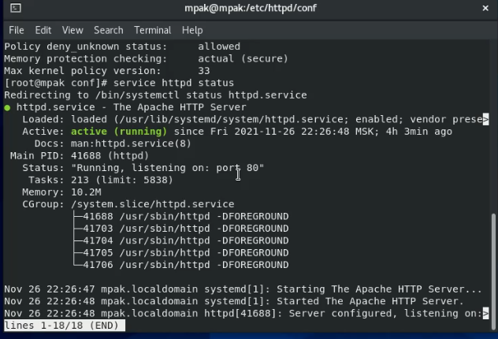
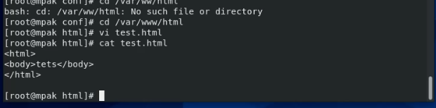
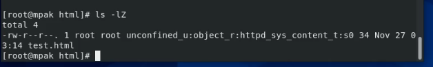
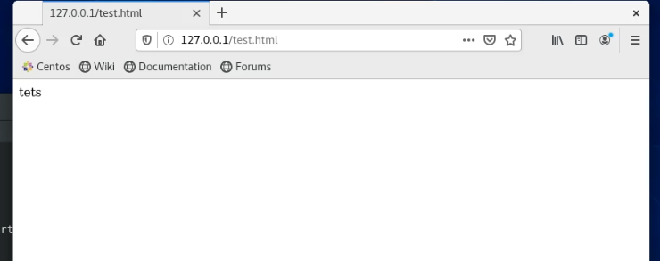
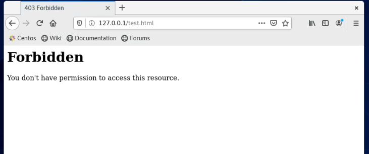
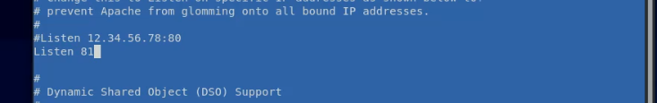
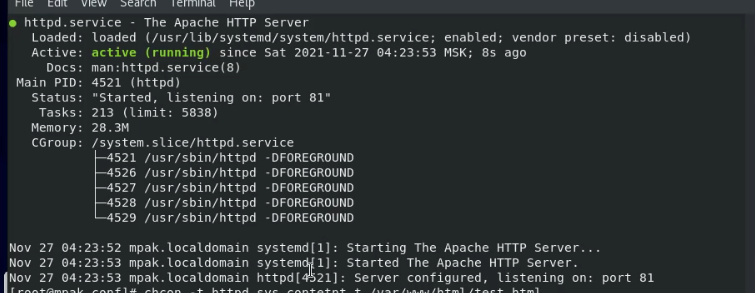
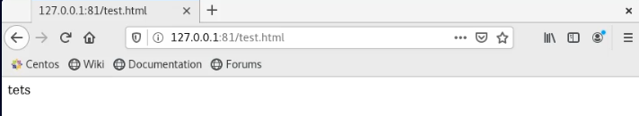
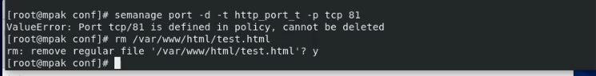

---
## Front matter
lang: ru-RU
title: Лабораторная работа №6
author: |
	Пак Мария  \inst{1}
	
institute: |
	\inst{1}RUDN University, Moscow, Russian Federation
	
date: 01.10.2021 Moscow, Russia

## Formatting
toc: false
slide_level: 2
theme: metropolis
header-includes: 
 - \metroset{progressbar=frametitle,sectionpage=progressbar,numbering=fraction}
 - '\makeatletter'
 - '\beamer@ignorenonframefalse'
 - '\makeatother'
aspectratio: 43
section-titles: true

---

## Прагматика выполнения лабораторной работы

Студенты должны разбираться в работе с атрибутами файлов и директорий, а также знать как пользователи с разными правами доступа взаимодействуют с ними. Все это необходимо для глубоко погружения в в среду Centos и для повышения безопасности в системе.

## Цель выполнения лабораторной работы

Развить навыки администрирования ОС Linux. Получить первое прак-
тическое знакомство с технологией SELinux1.
Проверить работу SELinx на практике совместно с веб-сервером
Apache.

## Задачи выполнения лабораторной работы

1. Войти в систему и убедиться во включенности Selinux и Апаче. Проверить их настройки. Определить контекст безопасности процессов  Apache.

2. Определить тип файлов и поддиректорий, находящихся в директории
/var/www.
Создайть от имени суперпользователя  html-файл /var/www/html/test.html 
Проверьте контекст созданного вами файла. 

3. Обратиться к файлу через веб-сервер, введя в браузере адрес
    http://127.0.0.1/test.html. Убедиться, что файл был успеш-
    но отображён.

4. Изменить контекст файла /var/www/html/test.html с httpd_sys_content_t на на samba_share_t:
Попробовать ещё раз получить доступ к файлу через веб-сервер, введя в браузере адрес http://127.0.0.1/test.html. 

5. Попробовать запустить веб-сервер Apache на прослушивание ТСР-порта
81,заменив строчку Listen 80 на Listen 81. Выполнить перезапуск веб-сервера Apache.

6.Добавить порт 81 в список. Запустить веб-сервер Apache ещё раз. 

7.Вернуть контекст httpd_sys_cоntent__t.После этого получить доступ к файлу через веб-сервер, введя в браузере адрес http://127.0.0.1:81/test.html.

8.Исправить обратно конфигурации.

## Результаты выполнения лабораторной работы

1. Вошла в систему и убедилась во включенности Selinux и Апаче, как указано в лабораторной работе. Проверила правильность их настроек. 
(рис. -@fig:002)
{ #fig:002 width=70% }
Контекст безопасности процессов  Apache - httpd_t.

## Результаты выполнения лабораторной работы

2. В директории /var/www/html, где храняться странички сайтов, которые подгружает в браузере Апаче, создаю навую страничку tets.html.
(рис. -@fig:007)
{ #fig:007 width=100% }
(рис. -@fig:008)
{ #fig:008 width=100% }
По умолчанию вновь созданным файлам в директории /var/www/html присваивается контекст httpd_sys_content_t. Этот контекст дает права процессам Апаче обрабатывать файлы. 

## Результаты выполнения лабораторной работы

3. Обратилась к новому файлу, введя в браузере адрес
    http://127.0.0.1/test.html. Файл успешно открылся.
(рис. -@fig:009)
{ #fig:009 width=100% }

## Результаты выполнения лабораторной работы

4. Изменила контекст файла /var/www/html/test.html с httpd_sys_content_t на на samba_share_t.
(рис. -@fig:012)
{ #fig:012 width=100% }
В браузере показывает ошибку доступа. 

## Результаты выполнения лабораторной работы

5. Попробовала запустить веб-сервер Apache на прослушивание ТСР-порта 81, заменив строчку Listen 80 на Listen 81. 
(рис. -@fig:015)
{ #fig:015 width=100% }
Выполнила перезапуск, веб-сервер не работал

## Результаты выполнения лабораторной работы

6.Добавила порт 81 в список испоьзуемых портов Апаче. 
В это раз веб-сервер Apache запустился. 
(рис. -@fig:022)
{ #fig:022 width=100% }

## Результаты выполнения лабораторной работы

7.Вернула контекст httpd_sys_cоntent__t. Веб-сервер, введя в браузере с адресом http://127.0.0.1:81/test.html заработал.
(рис. -@fig:024)
{ #fig:024 width=100% }

## Результаты выполнения лабораторной работы

8. Исправить обратно конфигурации.
(рис. -@fig:025)
{ #fig:025 width=100% }

## Результаты выполнения лабораторной работы

## Вывод

Развила навыки администрирования ОС Linux. Получила первое практическое знакомство с технологией SELinux1. Проверила работу SELinx на практике совместно с веб-сервером Apache.

## {.standout}Спасибо за внимание 
