---
# Front matter 
lang: ru-RU
title: "Лабораторная работа № 6"
subtitle: "Мандатное разграничение прав в Linux"
author: "Пак Мария НБИбд-01-18 1032184261"

# Formatting
toc-title: "Содержание"
toc: true # Table of contents
toc_depth: 2
lof: true # List of figures
lot: true # List of tables
fontsize: 12pt
linestretch: 1.5
papersize: a4paper
documentclass: scrreprt
polyglossia-lang: russian
polyglossia-otherlangs: english
mainfont: PT Serif
romanfont: PT Serif
sansfont: PT Sans
monofont: PT Mono
mainfontoptions: Ligatures=TeX
romanfontoptions: Ligatures=TeX
sansfontoptions: Ligatures=TeX,Scale=MatchLowercase
monofontoptions: Scale=MatchLowercase
indent: true
pdf-engine: lualatex
header-includes:
  - \linepenalty=10 # the penalty added to the badness of each line within a paragraph (no associated penalty node) Increasing the value makes tex try to have fewer lines in the paragraph.
  - \interlinepenalty=0 # value of the penalty (node) added after each line of a paragraph.
  - \hyphenpenalty=50 # the penalty for line breaking at an automatically inserted hyphen
  - \exhyphenpenalty=50 # the penalty for line breaking at an explicit hyphen
  - \binoppenalty=700 # the penalty for breaking a line at a binary operator
  - \relpenalty=500 # the penalty for breaking a line at a relation
  - \clubpenalty=150 # extra penalty for breaking after first line of a paragraph
  - \widowpenalty=150 # extra penalty for breaking before last line of a paragraph
  - \displaywidowpenalty=50 # extra penalty for breaking before last line before a display math
  - \brokenpenalty=100 # extra penalty for page breaking after a hyphenated line
  - \predisplaypenalty=10000 # penalty for breaking before a display
  - \postdisplaypenalty=0 # penalty for breaking after a display
  - \floatingpenalty = 20000 # penalty for splitting an insertion (can only be split footnote in standard LaTeX)
  - \raggedbottom # or \flushbottom
  - \usepackage{float} # keep figures where there are in the text
  - \floatplacement{figure}{H} # keep figures where there are in the text

---

# Лабораторная работа №6

[TOC]

## Цель работы
Развить навыки администрирования ОС Linux. Получить первое прак-
тическое знакомство с технологией SELinux1.
Проверить работу SELinx на практике совместно с веб-сервером
Apache.

## Задание

1. Войдите в систему с полученными учётными данными и убедитесь, что
   SELinux работает в режиме enforcing политики targeted с помощью ко-
   манд getenforce и sestatus.

2. Обратитесь с помощью браузера к веб-серверу, запущенному на вашем
    компьютере, и убедитесь, что последний работает:
    service httpd status
    или
    /etc/rc.d/init.d/httpd status
    Если не работает, запустите его так же, но с параметром start.
3. Найдите веб-сервер Apache в списке процессов, определите его контекст
    безопасности и занесите эту информацию в отчёт. Например, можно ис-
    пользовать команду
    ps auxZ | grep httpd
    или
    ps -eZ | grep httpd
4. Посмотрите текущее состояние переключателей SELinux для Apache с
    помощью команды
    sestatus -bigrep httpd
    Обратите внимание, что многие из них находятся в положении «off»
5. Посмотрите статистику по политике с помощью команды seinfo, также
    определите множество пользователей, ролей, типов.
6. Определите тип файлов и поддиректорий, находящихся в директории
    /var/www, с помощью команды
    ls -lZ /var/www
7. Определите тип файлов, находящихся в директории /var/www/html:
    ls -lZ /var/www/html
8. Определите круг пользователей, которым разрешено создание файлов в
    директории /var/www/html.
9. Создайте от имени суперпользователя (так как в дистрибутиве по-
    сле установки только ему разрешена запись в директорию) html-файл
    /var/www/html/test.html следующего содержания:
    <html>
    <body>test</body>
    </html>
10. Проверьте контекст созданного вами файла. Занесите в отчёт контекст,
    присваиваемый по умолчанию вновь созданным файлам в директории
    /var/www/html.
11. Обратитесь к файлу через веб-сервер, введя в браузере адрес
http://127.0.0.1/test.html. Убедитесь, что файл был успеш-
но отображён.
12. Изучите справку man httpd_selinux и выясните, какие контек-
    сты файлов определены для httpd. Сопоставьте их с типом файла
    test.html. Проверить контекст файла можно командой ls -Z.
    ls -Z /var/www/html/test.html
    Рассмотрим полученный контекст детально. Обратите внимание, что так
    как по умолчанию пользователи CentOS являются свободными от типа
    (unconfined в переводе с англ. означает свободный), созданному нами
    файлу test.html был сопоставлен SELinux, пользователь unconfined_u.
    Это первая часть контекста.
    Далее политика ролевого разделения доступа RBAC используется про-
    цессами, но не файлами, поэтому роли не имеют никакого значения для
    файлов. Роль object_r используется по умолчанию для файлов на «по-
    стоянных» носителях и на сетевых файловых системах. (В директории
    /ргос файлы, относящиеся к процессам, могут иметь роль system_r.
    Если активна политика MLS, то могут использоваться и другие роли,
    например, secadm_r. Данный случай мы рассматривать не будем, как и
    предназначение :s0).
    Тип httpd_sys_content_t позволяет процессу httpd получить доступ к фай-
    лу. Благодаря наличию последнего типа мы получили доступ к файлу
    при обращении к нему через браузер.
13. Измените контекст файла /var/www/html/test.html с
    httpd_sys_content_t на любой другой, к которому процесс httpd не
    должен иметь доступа, например, на samba_share_t:
    chcon -t samba_share_t /var/www/html/test.html
    ls -Z /var/www/html/test.html.После этого проверьте, что контекст поменялся.
14. Попробуйте ещё раз получить доступ к файлу через веб-сервер, введя в
    браузере адрес http://127.0.0.1/test.html. Вы должны получить
    сообщение об ошибке:
    Forbidden
    You don't have permission to access /test.html on this server.
15. Проанализируйте ситуацию. Почему файл не был отображён, если права
    доступа позволяют читать этот файл любому пользователю?
    ls -l /var/www/html/test.html
    Просмотрите log-файлы веб-сервера Apache. Также просмотрите си-
    стемный лог-файл:
    tail /var/log/messages
    Если в системе окажутся запущенными процессы setroubleshootd и
    audtd, то вы также сможете увидеть ошибки, аналогичные указанным
    выше, в файле /var/log/audit/audit.log. Проверьте это утвержде-
    ние самостоятельно.
    16. Попробуйте запустить веб-сервер Apache на прослушивание ТСР-порта
    81 (а не 80, как рекомендует IANA и прописано в /etc/services). Для
    этого в файле /etc/httpd/httpd.conf найдите строчку Listen 80 и
    замените её на Listen 81.
    17. Выполните перезапуск веб-сервера Apache. Произошёл сбой? Поясните
    почему?
    18. Проанализируйте лог-файлы:
    tail -nl /var/log/messages
    Просмотрите файлы /var/log/http/error_log,
    /var/log/http/access_log и /var/log/audit/audit.log и
    выясните, в каких файлах появились записи.
    19. Выполните команду
    semanage port -a -t http_port_t -р tcp 81
    После этого проверьте список портов командой
    semanage port -l | grep http_port_t
    Убедитесь, что порт 81 появился в списке.
    20. Попробуйте запустить веб-сервер Apache ещё раз. Поняли ли вы, почему
    он сейчас запустился, а в предыдущем случае не смог?
    21. Верните контекст httpd_sys_cоntent__t к файлу /var/www/html/ test.html:
    chcon -t httpd_sys_content_t /var/www/html/test.html
    После этого попробуйте получить доступ к файлу через веб-сервер, вве-
    дя в браузере адрес http://127.0.0.1:81/test.html.
    Вы должны увидеть содержимое файла — слово «test».
    22. Исправьте обратно конфигурационный файл apache, вернув Listen 80.
    23. Удалите привязку http_port_t к 81 порту:
    semanage port -d -t http_port_t -p tcp 81
    и проверьте, что порт 81 удалён.
    24. Удалите файл /var/www/html/test.html:
    rm /var/www/html/test.html

## Теоретическое введение

В операционной системе Linux есть много отличных функций безопасности, но она из самых важных - это система прав доступа к файлам. Linux, как последователь идеологии ядра Linux в отличие от Windows, изначально проектировался как многопользовательская система, поэтому права доступа к файлам в linux продуманы очень хорошо. И это очень важно, потому что локальный доступ к файлам для всех программ и всех пользователей позволил бы вирусам без проблем уничтожить систему [[1]](## Список литературы).

SELinux (SELinux) — это система принудительного контроля доступа, реализованная на уровне ядра. Впервые эта система появилась в четвертой версии CentOS, а в 5 и 6 версии реализация была существенно дополнена и улучшена. Эти улучшения позволили SELinux стать универсальной системой, способной эффективно решать массу актуальных задач. Стоит помнить, что классическая система прав Unix применяется первой, и управление перейдет к SELinux только в том случае, если эта первичная проверка будет успешно пройдена. [[2]](## Список литературы).

По сути, в традиционной модели избирательного управления доступом (DAC), хорошо реализованы только два уровня доступа — пользователь и суперпользователь. Нет простого метода, который позволил бы устанавливать для каждого пользователя необходимый минимум привилегий.
Конечно, есть множество методов обхода этих проблем в рамках классической модели безопасности, но ни один из них не является универсальным.

SELinux имеет три основных режим работы, при этом по умолчанию установлен режим Enforcing. Это довольно жесткий режим, и в случае необходимости он может быть изменен на более удобный для конечного пользователя.  [[3]](## Список литературы)

**Enforcing**: Режим по-умолчанию. При выборе этого режима все действия, которые каким-то образом нарушают текущую политику безопасности, будут блокироваться, а попытка нарушения будет зафиксирована в журнале. [[3]](## Список литературы)

**Permissive**: В случае использования этого режима, информация о всех действиях, которые нарушают текущую политику безопасности, будут зафиксированы в журнале, но сами действия не будут заблокированы. [[3]](## Список литературы)

**Disabled**: Полное отключение системы принудительного контроля доступа. [[3]](## Список литературы).

## Оборудование

Лабораторная работа выполнялась дома со следующими характеристиками техники: 

– Intel(R) Core(TM) i7-7700HQ CPU @ 2.80GHz 2.81GHz
– ОС Майкрософт Windows 10
– VirtualBox верс. 6.1.26

# Выполнение лабораторной работы
 1. Вошла в систему с полученными учётными данными и убедилась, что
      SELinux работает в режиме enforcing политики targeted с помощью ко-
      манд getenforce и sestatus.
      (рис. -@fig:001)
      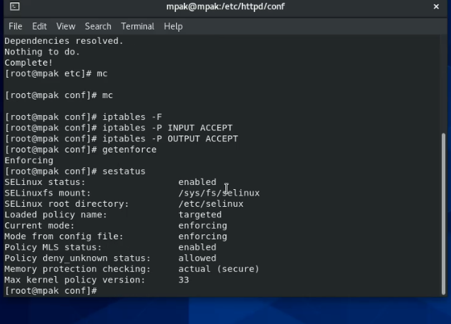{ #fig:001 width=70% }

2. C помощью команды service httpd status видим, что наш сервер работает.
(рис. -@fig:002)
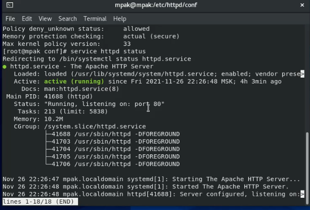{ #fig:002 width=70% }

3. Нашла веб-сервер Apache в списке процессов, его контекст безопасности - httpd_t 
(рис. -@fig:003)
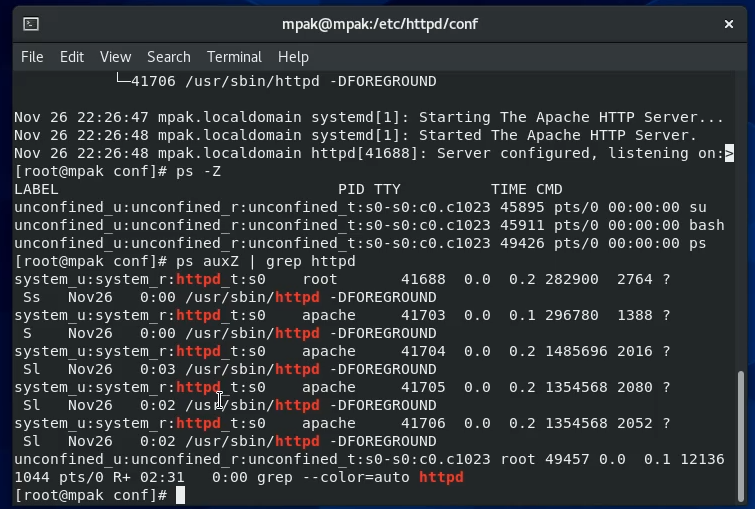{ #fig:003 width=70% }

4. Посмотрела текущее состояние переключателей SELinux для Apache. Большинство из них находятся в положении «off».
(рис. -@fig:004)
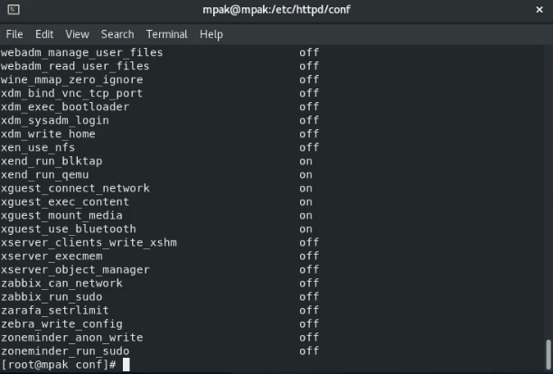{ #fig:004 width=70% }

5.Посмотрела статистику по политике с помощью команды seinfo. Определите множество пользователей - 8, ролей - 37, типов - 4958.
(рис. -@fig:005)
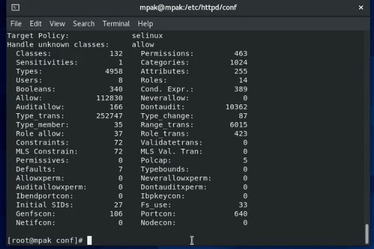{ #fig:005 width=100% }

6-8. Определила тип файлов и поддиректорий, находящихся в директории /var/www. Там находятся директории html и cgi-bin, где будут храниться файлы соответсвующей категории. В директории html пока нет файлов, так как я не создавала пока странички сайтов сервера.
(рис. -@fig:006)
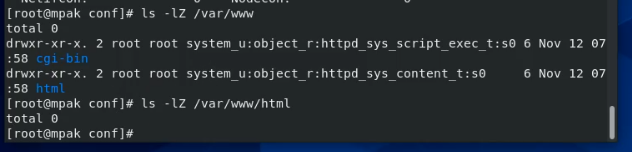{ #fig:006 width=100% }

Как видно по информации директории html, создание файлов разрешено там только пользователю рут.

9. Создала от имени суперпользователя html-файл test.html.
(рис. -@fig:007)
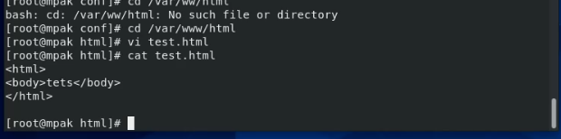{ #fig:007 width=100% }

10. Проверила конкеткст только что созданного файла test.html.
Занесите в отчёт контекст, присваиваемый по умолчанию вновь созданным файлам в директории /var/www/html. 
(рис. -@fig:008)
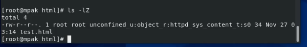{ #fig:008 width=100% }

По умолчанию вновь созданным файлам в директории /var/www/html присваивается контекст httpd_sys_content_t. Этот контекст дает права процессам Апаче обрабатывать файлы. 

11. Обратилась к файлу через веб-сервер, введя в браузере адрес http://127.0.0.1/test.html. Убедилась, что файл был успешно отображён.
(рис. -@fig:009)
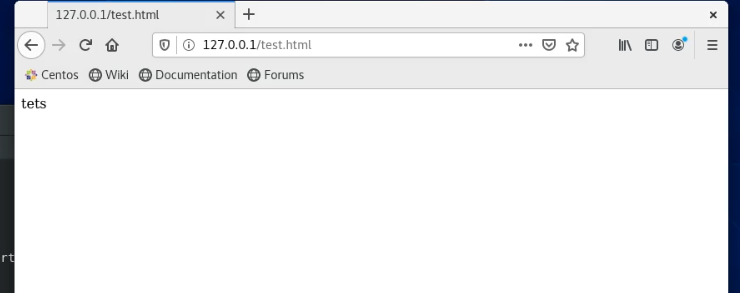{ #fig:009 width=100% }

12. Изучите справку man httpd_selinux и выясните, какие контексты файлов определены для httpd. Сопоставьте их с типом файла test.html.
(рис. -@fig:010)
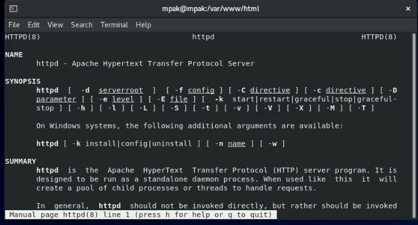{ #fig:010 width=100% }

Контекст имеет схему: Тип, роль, домен
Тип unconfined_u - создал пользователь, свободный от типа (типично для пользователей CentOS )
Роль - object_r используется по умолчанию для файлов на «постоянных» носителях и на сетевых файловых системах.  
Домен - httpd_sys_content_t позволяет процессу httpd получить доступ к файлу

13. Изменила контекст файла /var/www/html/test.html с httpd_sys_content_t на samba_share_t:
(рис. -@fig:011)
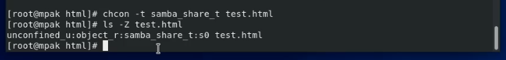{ #fig:011 width=100% }
Контекст действительно поменялся.

14. Попробовала ещё раз получить доступ к файлу через веб-сервер, введя в браузере адрес http://127.0.0.1/test.html. И получила сообщение об ошибке.
(рис. -@fig:012)
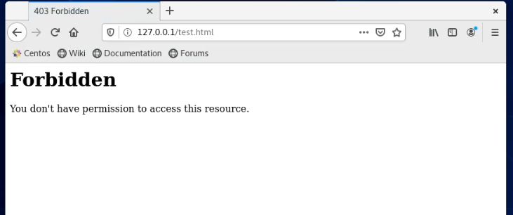{ #fig:012 width=100% }

15. Файл не был отображён, потому что то процесс апаче, который должен был отобразить страничку html, не смог получить доступ к файлу из-за измененного контекста. Это специальное свойство контекста, которое защищает систему от взлома злоумышленниками.

Просмотрела log-файлы веб-сервера Apache. 
/var/log/messages 
(рис. -@fig:013)
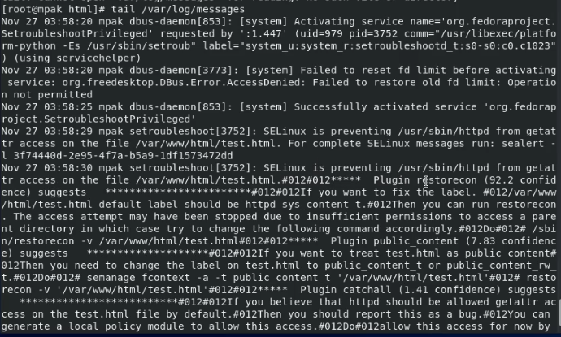{ #fig:013 width=100% }

/var/log/audit/audit.log.
(рис. -@fig:014)
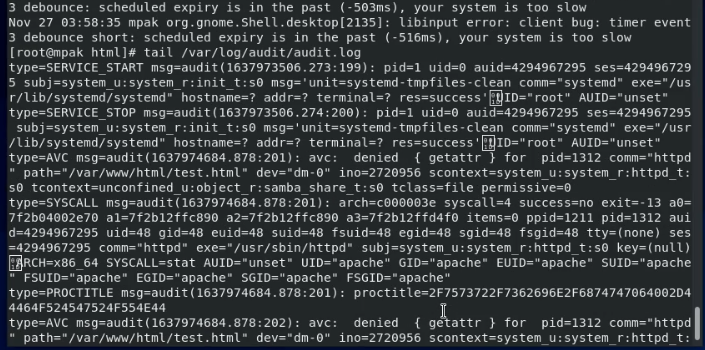{ #fig:014 width=100% }    

В обоих файлах можно найти записи процессы setroubleshootd и audtd, где можно увидеть ошибки, аналогичные указанным выше.

16-17. Попробовала запустить веб-сервер Apache на прослушивание ТСР-порта 81 . Для этого в файле /etc/httpd/httpd.conf  заменила строчку на Listen 81.
(рис. -@fig:015)
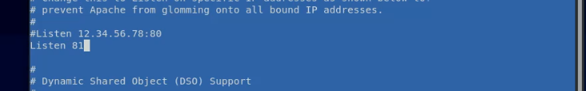{ #fig:015 width=100% }

Выполнила перезапуск веб-сервера Apache. Должен был произойти сбой, но он не произошел, так как у меня порт 81 был уже записан в системе как используемый.
(рис. -@fig:016)
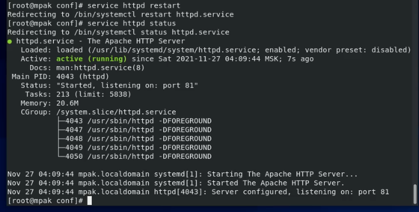{ #fig:016 width=100% }

18. Проанализировала лог-файлы:
tail -nl /var/log/messages 
(рис. -@fig:017)
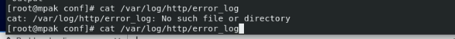{ #fig:017 width=100% }
/var/log/http/error_log
(рис. -@fig:018)
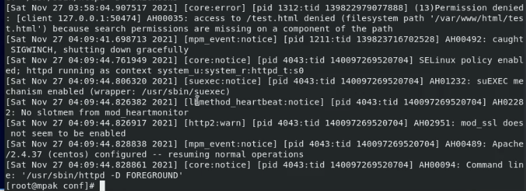{ #fig:018 width=100% }
/var/log/http/access_log 
(рис. -@fig:019)
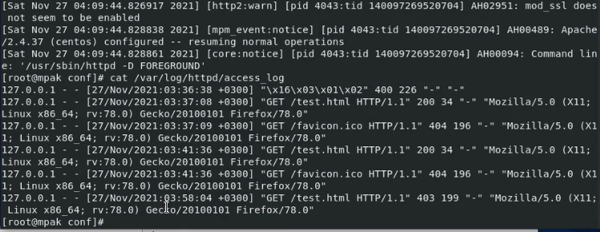{ #fig:019 width=100% }
/var/log/audit/audit.log 
(рис. -@fig:020)
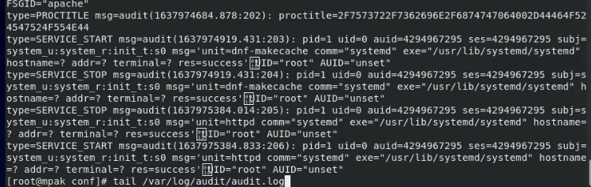{ #fig:020 width=100% }
Так как у меня все же запустился сервер, то я просто назову, где бы повились сообщения об ошибках. Ошибки будут в : /var/log/http/error_log, /var/log/audit/audit.log  и /var/log/messages

19. Добавила 81 порт командой.
(рис. -@fig:021)
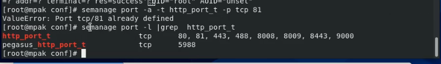{ #fig:021 width=100% }

Убедилась, что порт 81 появился в списке.
    
20. Попробовала запустить веб-сервер Apache ещё раз. Он запустился сейчас, так как мы добавили порт к используемым в сервисе Апаче.

(рис. -@fig:022)
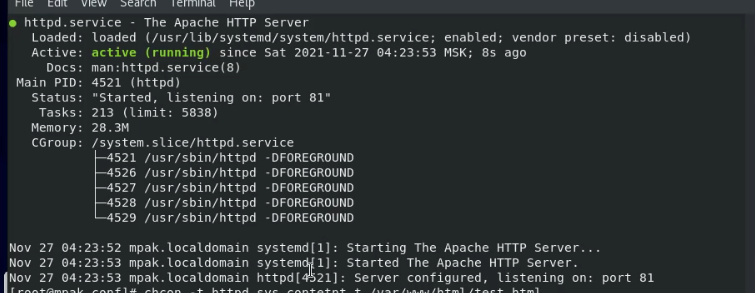{ #fig:022 width=100% }

 21. Вернула контекст httpd_sys_cоntent_t
(рис. -@fig:023)
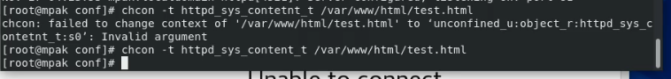{ #fig:023 width=100% }

Теперь веб-сервер открывается, введя в браузере адрес http://127.0.0.1:81/test.html.

(рис. -@fig:024)
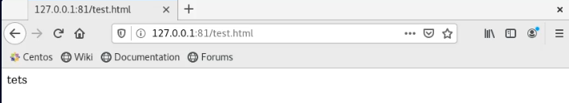{ #fig:024 width=100% }

22-24. Исправила обратно конфигурационный файл apache, вернув Listen 80.
Удалила привязку http_port_t к 81 порту
Удалите файл /var/www/html/test.html

(рис. -@fig:025)
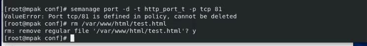{ #fig:025 width=100% }

Не забыла выйти из режима суперпользователя.

## Выводы
Развила навыки администрирования ОС Linux. Получила первое практическое знакомство с технологией SELinux1. Проверила работу SELinx на практике совместно с веб-сервером Apache.

## Список литературы 

1.SELinux – описание и особенности работы с системой. Часть 1 // Habr URL: https://habr.com/ru/company/kingservers/blog/209644/ (дата обращения: 26.11.2021).

2.Контексты SELinux // fedora URL: https://docs.fedoraproject.org/ru-RU/Fedora/13/html/Security-Enhanced_Linux/chap-Security-Enhanced_Linux-SELinux_Contexts.html (дата обращения: 25.11.2021).

3.Безопасная эксплуатация Apache, часть 1: базовые понятия // rus-linux URL: http://rus-linux.net/MyLDP/server/securing-apache-part-1.html (дата обращения: 26.11.2021).

