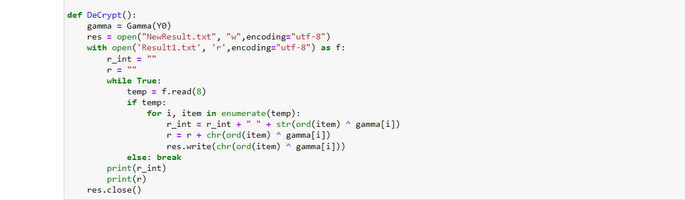
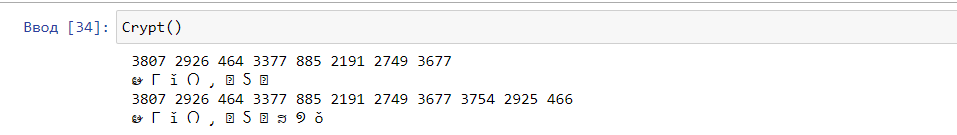
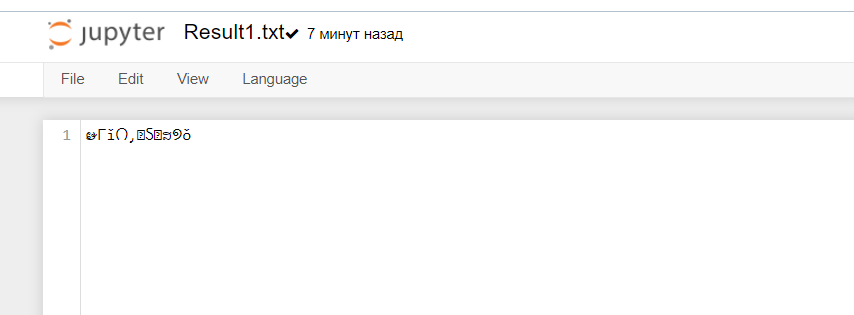

---
## Front matter
lang: ru-RU
title: Лабораторная работа №7Элементы криптографии. Однократное гаммирование
author: |
	Пак Мария  \inst{1}
	
institute: |
	\inst{1}RUDN University, Moscow, Russian Federation
	
date: 01.10.2021 Moscow, Russia

## Formatting
toc: false
slide_level: 2
theme: metropolis
header-includes: 
 - \metroset{progressbar=frametitle,sectionpage=progressbar,numbering=fraction}
 - '\makeatletter'
 - '\beamer@ignorenonframefalse'
 - '\makeatother'
aspectratio: 43
section-titles: true

---

## Прагматика выполнения лабораторной работы

Студенты должны разбираться в методах шифрования и познакомиться способом шифрования текста гаммированию. Все это необходимо для глубоко погружения в в среду Centos и для повышения безопасности в системе.

## Цель выполнения лабораторной работы

Освоить на практике применение режима однократного гаммирования.

## Задачи выполнения лабораторной работы

Разработать приложение, позволяющее шифровать и дешифровать данные в режиме однократного гаммирования. Приложение должно: 

1. Определить вид шифротекста при известном ключе и известном открытом тексте. 
2. Определить ключ, с помощью которого шифротекст может быть преобразован в некоторый фрагмент текста, представляющий собой один из возможных вариантов прочтения открытого текста.

## Результаты выполнения лабораторной работы

1. Разработала программу, позволяющею шифровать и дешифровать данные в режиме однократного гаммирования. Программа имеет следующий вид.

      (рис. -@fig:001)
      { #fig:001 width=100% }

      (рис. -@fig:002)
      { #fig:001 width=100% }

      Приложение написано на python 3. Я запускала его через jupiter Notebook. В данном коде имеется 3 основные функции. 1 - создает гамму, 2 - шифрует текст, 3 - расшифровывает шифротекст. 

## Результаты выполнения лабораторной работы

2. Программа работает по следующему алгоритму. Сначала пользователь вводит свой текст, который хочет зашифровать в файл source.txt. Далее пользователь заходит в ноутбук, запускает функцию шифрование. Зашифрованный текст и гамма появляются в файле result.txt. 

     (рис. -@fig:003)
     { #fig:001 width=100% }

(рис. -@fig:006)
{ #fig:001 width=100% }

## Результаты выполнения лабораторной работы

3. Для расшифровки текста, пользователь запускает функцию расшифровки в ноутбуке. Функция на основе нашего шифротекста использует гамму и мы получаем исходный текст. (рис. -@fig:005)
     { #fig:001 width=100% }
     

(рис. -@fig:004)
{ #fig:001 width=100% }

## Вывод

Освоен на практике метод однократного гаммирования. Написана программа по шифровке и дешифровке.

## {.standout}Спасибо за внимание 
