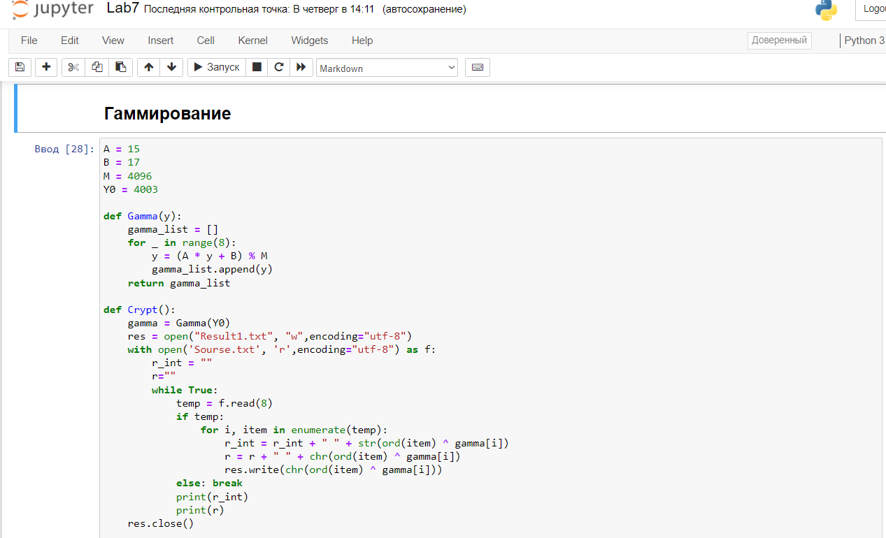

---
# Front matter 
lang: ru-RU
title: "Лабораторная работа № 7"
subtitle: " Элементы криптографии. Однократное гаммирование"
author: "Пак Мария НБИбд-01-18 1032184261"

# Formatting
toc-title: "Содержание"
toc: true # Table of contents
toc_depth: 2
lof: true # List of figures
lot: true # List of tables
fontsize: 12pt
linestretch: 1.5
papersize: a4paper
documentclass: scrreprt
polyglossia-lang: russian
polyglossia-otherlangs: english
mainfont: PT Serif
romanfont: PT Serif
sansfont: PT Sans
monofont: PT Mono
mainfontoptions: Ligatures=TeX
romanfontoptions: Ligatures=TeX
sansfontoptions: Ligatures=TeX,Scale=MatchLowercase
monofontoptions: Scale=MatchLowercase
indent: true
pdf-engine: lualatex
header-includes:
  - \linepenalty=10 # the penalty added to the badness of each line within a paragraph (no associated penalty node) Increasing the value makes tex try to have fewer lines in the paragraph.
  - \interlinepenalty=0 # value of the penalty (node) added after each line of a paragraph.
  - \hyphenpenalty=50 # the penalty for line breaking at an automatically inserted hyphen
  - \exhyphenpenalty=50 # the penalty for line breaking at an explicit hyphen
  - \binoppenalty=700 # the penalty for breaking a line at a binary operator
  - \relpenalty=500 # the penalty for breaking a line at a relation
  - \clubpenalty=150 # extra penalty for breaking after first line of a paragraph
  - \widowpenalty=150 # extra penalty for breaking before last line of a paragraph
  - \displaywidowpenalty=50 # extra penalty for breaking before last line before a display math
  - \brokenpenalty=100 # extra penalty for page breaking after a hyphenated line
  - \predisplaypenalty=10000 # penalty for breaking before a display
  - \postdisplaypenalty=0 # penalty for breaking after a display
  - \floatingpenalty = 20000 # penalty for splitting an insertion (can only be split footnote in standard LaTeX)
  - \raggedbottom # or \flushbottom
  - \usepackage{float} # keep figures where there are in the text
  - \floatplacement{figure}{H} # keep figures where there are in the text

---

# Лабораторная работа №7

[TOC]

## Цель работы
Освоить на практике применение режима однократного гаммирования.

## Задание

Нужно подобрать ключ, чтобы получить сообщение «С Новым Годом, друзья!». Требуется разработать приложение, позволяющее шифровать и дешифровать данные в режиме однократного гаммирования. Приложение должно: 

1. Определить вид шифротекста при известном ключе и известном открытом тексте. 
   2. Определить ключ, с помощью которого шифротекст может быть преобразован в некоторый фрагмент текста, представляющий собой один из возможных вариантов прочтения открытого текста.

## Теоретическое введение

Предложенная Г. С. Вернамом так называемая «схема однократного использования (гаммирования)» является простой, но надёжной схемой шифрования данных. Гаммирование представляет собой наложение (снятие) на открытые (зашифрованные) данные последовательности элементов других данных, полученной с помощью некоторого криптографического алгоритма, для получения зашифрованных (открытых) данных. [[1]](## Список литературы).

Иными словами, наложение гаммы — это сложение её элементов с элементами открытого (закрытого) текста по некоторому фиксированному модулю, значение которого представляет собой известную часть алгоритма шифрования. В соответствии с теорией криптоанализа, если в методе шифрования используется однократная вероятностная гамма (однократное гаммирование) той же длины, что и подлежащий сокрытию текст, то текст нельзя раскрыть. Даже при раскрытии части последовательности гаммы нельзя получить информацию о всём скрываемом тексте.[[2]](## Список литературы)

Гаммирование является симметричным алгоритмом. Поскольку двойное прибавление одной и той же величины по модулю 2 восстанавливает исходное значение, шифрование и дешифрование выполняется одной и той же программой [[3]](## Список литературы).

## Оборудование

Лабораторная работа выполнялась дома со следующими характеристиками техники: 

– Intel(R) Core(TM) i7-7700HQ CPU @ 2.80GHz 2.81GHz
– ОС Майкрософт Windows 10
– VirtualBox верс. 6.1.26

# Выполнение лабораторной работы
 1. Разработала программу, позволяющею шифровать и дешифровать данные в режиме однократного гаммирования. Программа имеет следующий вид.

      (рис. -@fig:001)
      { #fig:001 width=100% }

      (рис. -@fig:002)
      { #fig:001 width=100% }

      Приложение написано на python 3. Я запускала его через jupiter Notebook. В данном коде имеется 3 основные функции. 1 - создает гамму, 2 - шифрует текст, 3 - расшифровывает шифротекст. 

      2. Программа работает по следующему алгоритму. Сначала пользователь вводит свой текст, который хочет зашифровать в файл source.txt. Далее пользователь заходит в ноутбук, запускает функцию шифрование. Зашифрованный текст и гамма появляются в файле result.txt. 

         (рис. -@fig:003)
         { #fig:001 width=100% }

         (рис. -@fig:006)
         { #fig:001 width=100% }

      3. Для расшифровки текста, пользователь запускает функцию расшифровки в ноутбуке. Функция на основе нашего шифротекста использует гамму и мы получаем исходный текст. 

         (рис. -@fig:005)
         { #fig:001 width=100% }

         (рис. -@fig:004)
         { #fig:001 width=100% }

## Выводы
Освоен на практике применение режима однократного гаммирования. Написана программа по шифровке и дешифровке.

## Список литературы 

1. Шифры замены и табличного гаммирования // Хабр URL: https://habr.com/ru/post/583616/ (дата обращения: 10.12.2021).
2. Лабораторная работа № 7. Элементы криптографии. Однократное гаммирование // Туис URL: https://esystem.rudn.ru/pluginfile.php/1198312/mod_resource/content/2/007-lab_crypto-gamma.pdf (дата обращения: 9.12.2021).
3. Простейшие методы шифрования с закрытым ключом // НОУ ИНТУТ URL: https://intuit.ru/studies/courses/691/547/lecture/12373?page=4 (дата обращения: 9.12.2021).

