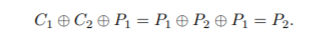
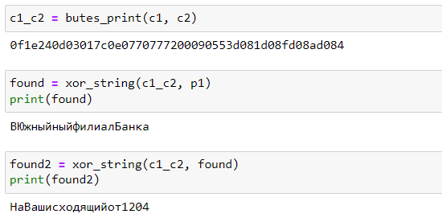

---
## Front matter
lang: ru-RU
title: Лабораторная работа №8
Элементы криптографии. Шифрование (кодирование) различных исходных текстов одним ключом
author: |
	Пак Мария  \inst{1}
	
institute: |
	\inst{1}RUDN University, Moscow, Russian Federation
	
date: 01.10.2021 Moscow, Russia

## Formatting
toc: false
slide_level: 2
theme: metropolis
header-includes: 
 - \metroset{progressbar=frametitle,sectionpage=progressbar,numbering=fraction}
 - '\makeatletter'
 - '\beamer@ignorenonframefalse'
 - '\makeatother'
aspectratio: 43
section-titles: true

---

## Прагматика выполнения лабораторной работы

Студенты должны разбираться в методах шифрования и познакомиться способом шифрования текста гаммированию. Все это необходимо для общего понимания методов шифрования и повышения безопасности в системах.

## Цель выполнения лабораторной работы

Освоить на практике применение режима однократного гаммирования на примере кодирования различных исходных текстов одним ключом

## Задачи выполнения лабораторной работы

1. Разработать приложение, позволяющее шифровать и дешифровать тексты P1 и P2 в режиме однократного гаммирования. 

2. Приложение должно определить вид шифротекстов C1 и C2 обоих текстов P1 и P2 при известном ключе 

3. Определить и выразить аналитически способ, при котором злоумышленник может прочитать оба текста, не зная ключа и не стремясь его определить.

## Результаты выполнения лабораторной работы

1. Разработала приложение, позволяющее шифровать и дешифровать тексты P1 и P2 в режиме однократного гаммирования. 

      (рис. -@fig:001)
      { #fig:001 width=100% }

      Приложение написано на python 3. Я запускала его через jupiter Notebook. В данном коде имеется 2 основные функции. 1 - сложение по модулю 2, 2 - представление в байтовом виде.

## Результаты выполнения лабораторной работы

2. Определим вид шифро-текстов C1 и C2 обоих текстов P1 и P2 при известном ключе. Для того запустим данную часть кода в нашем ноутбуке. 

     (рис. -@fig:002)
     { #fig:002 width=100% }

С помощью функции byte_print() шифруем оба текста p1 и p2 с помощью одного заранее созданного ключа k. byte_print() вызывает xor_string(), которая складывает два предложения по модулю 2. Сохраняем полученные зашифрованные тексты в переменные с1 и с2. Далее функция представляет их в буквенном виде и показывает нам. 

## Результаты выполнения лабораторной работы

3. Далее воспользуемся способом, который даст нам разгадать оба зашифрованных текста, без использования нашего ключа.
     
     Следуем дальше этой схеме, представленной в инструкции к лабораторной работе.
     
     (рис. -@fig:003)
     { #fig:003 width=100% }

Складываем 2 зашифрованных текста по модулю. Получившийся результат складываем с одним из расшифрованных текстов p1. Выводим получившийся результат сложения с1, с2 и р1. У нас получается расшифрованный текст p2, который мы сохраняем. Теперь уже получившийся расшифрованный текст складываем по модулю 2 с c1 и с2. Теперь же у нас получается расшифрованный р1. 

(рис. -@fig:004)
{ #fig:004 width=100% }

Т.е. мы можем расшифровать любой текст, если у нас имеется два зашифрованных текста одной гаммой, и один расшифрованный текст. Т. е нам даже не нужно знать шифровальный ключ для данных операций.

## Вывод

Освоила на практике применение режима однократного гаммирования на примере кодирования различных исходных текстов одним ключом.

## {.standout}Спасибо за внимание 
