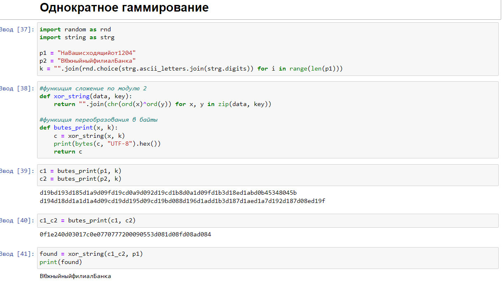
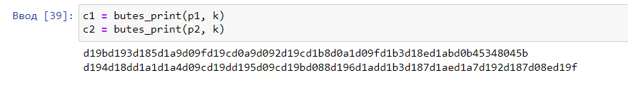
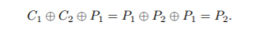
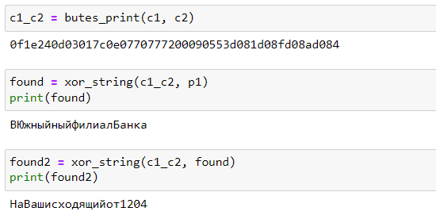

---
# Front matter 
lang: ru-RU
title: "Лабораторная работа № 8"
subtitle: "Элементы криптографии. Шифрование (кодирование) различных исходных текстов одним ключом"
author: "Пак Мария НБИбд-01-18 1032184261"

# Formatting
toc-title: "Содержание"
toc: true # Table of contents
toc_depth: 2
lof: true # List of figures
lot: true # List of tables
fontsize: 12pt
linestretch: 1.5
papersize: a4paper
documentclass: scrreprt
polyglossia-lang: russian
polyglossia-otherlangs: english
mainfont: PT Serif
romanfont: PT Serif
sansfont: PT Sans
monofont: PT Mono
mainfontoptions: Ligatures=TeX
romanfontoptions: Ligatures=TeX
sansfontoptions: Ligatures=TeX,Scale=MatchLowercase
monofontoptions: Scale=MatchLowercase
indent: true
pdf-engine: lualatex
header-includes:
  - \linepenalty=10 # the penalty added to the badness of each line within a paragraph (no associated penalty node) Increasing the value makes tex try to have fewer lines in the paragraph.
  - \interlinepenalty=0 # value of the penalty (node) added after each line of a paragraph.
  - \hyphenpenalty=50 # the penalty for line breaking at an automatically inserted hyphen
  - \exhyphenpenalty=50 # the penalty for line breaking at an explicit hyphen
  - \binoppenalty=700 # the penalty for breaking a line at a binary operator
  - \relpenalty=500 # the penalty for breaking a line at a relation
  - \clubpenalty=150 # extra penalty for breaking after first line of a paragraph
  - \widowpenalty=150 # extra penalty for breaking before last line of a paragraph
  - \displaywidowpenalty=50 # extra penalty for breaking before last line before a display math
  - \brokenpenalty=100 # extra penalty for page breaking after a hyphenated line
  - \predisplaypenalty=10000 # penalty for breaking before a display
  - \postdisplaypenalty=0 # penalty for breaking after a display
  - \floatingpenalty = 20000 # penalty for splitting an insertion (can only be split footnote in standard LaTeX)
  - \raggedbottom # or \flushbottom
  - \usepackage{float} # keep figures where there are in the text
  - \floatplacement{figure}{H} # keep figures where there are in the text

---

# Лабораторная работа №8

[TOC]

## Цель работы
Освоить на практике применение режима однократного гаммирования на примере кодирования различных исходных текстов одним ключом

## Задание

Необходимо разработать приложение, позволяющее шифровать и дешифровать тексты P1 и P2 в режиме однократного гаммирования. 

Приложение должно определить вид шифротекстов C1 и C2 обоих текстов P1 и P2 при известном ключе 

Необходимо определить и выразить аналитически способ, при котором злоумышленник может прочитать оба текста, не зная ключа и не стремясь его определить.

## Теоретическое введение

Предложенная Г. С. Вернамом так называемая «схема однократного использования (гаммирования)» является простой, но надёжной схемой шифрования данных. Гаммирование представляет собой наложение (снятие) на открытые (зашифрованные) данные последовательности элементов других данных, полученной с помощью некоторого криптографического алгоритма, для получения зашифрованных (открытых) данных. [[1]](## Список литературы).

Иными словами, наложение гаммы — это сложение её элементов с элементами открытого (закрытого) текста по некоторому фиксированному модулю, значение которого представляет собой известную часть алгоритма шифрования. В соответствии с теорией криптоанализа, если в методе шифрования используется однократная вероятностная гамма (однократное гаммирование) той же длины, что и подлежащий сокрытию текст, то текст нельзя раскрыть. Даже при раскрытии части последовательности гаммы нельзя получить информацию о всём скрываемом тексте.[[2]](## Список литературы)

Гаммирование является симметричным алгоритмом. Поскольку двойное прибавление одной и той же величины по модулю 2 восстанавливает исходное значение, шифрование и дешифрование выполняется одной и той же программой [[3]](## Список литературы).

## Оборудование

Лабораторная работа выполнялась дома со следующими характеристиками техники: 

– Intel(R) Core(TM) i7-7700HQ CPU @ 2.80GHz 2.81GHz
– ОС Майкрософт Windows 10
– VirtualBox верс. 6.1.26

# Выполнение лабораторной работы
 1. Разработала приложение, позволяющее шифровать и дешифровать тексты P1 и P2 в режиме однократного гаммирования. 

      (рис. -@fig:001)
      { #fig:001 width=100% }

      Приложение написано на python 3. Я запускала его через jupiter Notebook. В данном коде имеется 2 основные функции. 1 - сложение по модулю 2, 2 - представление в байтовом виде.

      2. Определим вид шифро-текстов C1 и C2 обоих текстов P1 и P2 при известном ключе. Для того запустим данную часть кода в нашем ноутбуке. 

         (рис. -@fig:002)
         { #fig:002 width=100% }

      С помощью функции byte_print() шифруем оба текста p1 и p2 с помощью одного заранее созданного ключа k. byte_print() вызывает xor_string(), которая складывает два предложения по модулю 2. Сохраняем полученные зашифрованные тексты в переменные с1 и с2. Далее функция представляет их в буквенном виде и показывает нам. 

      3. Далее воспользуемся способом, который даст нам разгадать оба зашифрованных текста, без использования нашего ключа.

         Следуем дальше этой схеме, представленной в инструкции к лабораторной работе.

         (рис. -@fig:003)
         { #fig:003 width=100% }

      

      Складываем 2 зашифрованных текста по модулю. Получившийся результат складываем с одним из расшифрованных текстов p1. Выводим получившийся результат сложения с1, с2 и р1. У нас получается расшифрованный текст p2, который мы сохраняем. Теперь уже получившийся расшифрованный текст складываем по модулю 2 с c1 и с2. Теперь же у нас получается расшифрованный р1. 

      (рис. -@fig:004)
      { #fig:004 width=100% }

      Т.е. мы можем расшифровать любой текст, если у нас имеется два зашифрованных текста одной гаммой, и один расшифрованный текст. Т. е нам даже не нужно знать шифровальный ключ для данных операций.

## Выводы
Освоила на практике применение режима однократного гаммирования на примере кодирования различных исходных текстов одним ключом.

## Список литературы 

1. Шифры замены и табличного гаммирования // Хабр URL: https://habr.com/ru/post/583616/ (дата обращения: 10.12.2021).
2. Лабораторная работа № 7. Элементы криптографии. Однократное гаммирование // Туис URL: https://esystem.rudn.ru/pluginfile.php/1198312/mod_resource/content/2/007-lab_crypto-gamma.pdf (дата обращения: 9.12.2021).
3. Простейшие методы шифрования с закрытым ключом // НОУ ИНТУТ URL: https://intuit.ru/studies/courses/691/547/lecture/12373?page=4 (дата обращения: 9.12.2021).

