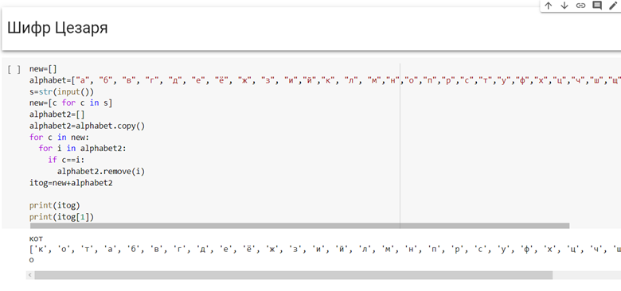

---
## Front matter
lang: ru-RU
title: Лабораторная работа №1
author: |
	Пак Мария  \inst{1}
	
institute: |
	\inst{1}RUDN University, Moscow, Russian Federation
	
date: 17.9.2022 Moscow, Russia

## Formatting
toc: false
slide_level: 2
theme: metropolis
header-includes: 
 - \metroset{progressbar=frametitle,sectionpage=progressbar,numbering=fraction}
 - '\makeatletter'
 - '\beamer@ignorenonframefalse'
 - '\makeatother'
aspectratio: 43
section-titles: true

---

## Прагматика выполнения лабораторной работы

В целях освоения программы предмета "Математические основы безопасности" студенты должны разбираться в основных принципах шифрования и дешифрования текста. На примере Шифров простой замены можно понять логику шифрования важной информации в электронных устройствах и принципы защиты информации. Все это необходимо для повышения безопасности в системе при работе с персональными или корпоративными компьютерами.

## Цель выполнения лабораторной работы

Освоить на практике написание шифров простой замены. Таких как шифр Атбаш и шифр Цезаря.

## Задачи выполнения лабораторной работы

1. Реализовать шифр Цезаря с ключем k символов.

2) Реализовать шифр Атбаш.

## Результаты выполнения лабораторной работы

1. Реализовала Шифр Цезаря. Показала создание нового шифровочного алфавита. В качестве ключа использовала любое слово без повторяющихся букв.

   (рис. -@fig:001)
   { #fig:001 width=100% }

   На данном слайде можно увидеть, как для создания шифровочного алфавита я использовала слово **кот**, и как по стандартному методу оно появляется в начале нового алфавита, а вся остальная часть заполняется оставшимися буквами.

## Результаты выполнения лабораторной работы

2. Зашифровала слово с помощью нового алфавита. 

   (рис. -@fig:002)
   { #fig:002 width=100% }  

  

## Результаты выполнения лабораторной работы

3. Дешифровала символы.

   (рис. -@fig:003)
   { #fig:003 width=100% }

Теперь зашифрованную мешанину из символов расшифровала, так как у меня уже было слово-ключ и шифроалфавит. Тем самым я вернула **чебурек** на родину.

## Результаты выполнения лабораторной работы

Реализовала Шифр Атбаш с попощью обратного алфавита. Зашифровала слово.

(рис. -@fig:001)
{ #fig:001 width=100% }

Так как шифрованием методом Атбаш является фактически нахождением букв обратным в алфавите, то для нахождения обратной буквы можно отнять от числа символов в списе место, на котором стоит шифруемая буква. Именно по такому принципу работает программа, которая на слайде зашифровала слово **кот**.  

## Результаты выполнения лабораторной работы

5. Дешифровала шифруемое слово с шифром Атбаш.

   (рис. -@fig:001)
   { #fig:001 width=100% }

   Используя ту же программу, с помощью которой мы шифровали слово, можно спокойно дешифровать и вернуть **кота**.

## Выводы

В ходе данной лабораторной работы, написала 2 программы для шифров простой замены. Поняла принцип шифрования и освоила написание шифров Атбаш и Цезаря на языке Python.

## {.standout}

Спасибо за внимание 