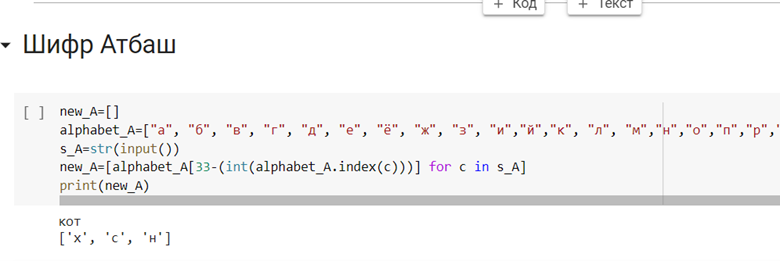

---
# Front matter 
lang: ru-RU
title: "Лабораторная работа № 1"
subtitle: "Шифры простой замены"
author: "Пак Мария НФИмд-02-22 10322225516"

# Formatting
toc-title: "Содержание"
toc: true # Table of contents
toc_depth: 2
lof: true # List of figures
lot: true # List of tables
fontsize: 12pt
linestretch: 1.5
papersize: a4paper
documentclass: scrreprt
polyglossia-lang: russian
polyglossia-otherlangs: english
mainfont: PT Serif
romanfont: PT Serif
sansfont: PT Sans
monofont: PT Mono
mainfontoptions: Ligatures=TeX
romanfontoptions: Ligatures=TeX
sansfontoptions: Ligatures=TeX,Scale=MatchLowercase
monofontoptions: Scale=MatchLowercase
indent: true
pdf-engine: lualatex
header-includes:
  - \linepenalty=10 # the penalty added to the badness of each line within a paragraph (no associated penalty node) Increasing the value makes tex try to have fewer lines in the paragraph.
  - \interlinepenalty=0 # value of the penalty (node) added after each line of a paragraph.
  - \hyphenpenalty=50 # the penalty for line breaking at an automatically inserted hyphen
  - \exhyphenpenalty=50 # the penalty for line breaking at an explicit hyphen
  - \binoppenalty=700 # the penalty for breaking a line at a binary operator
  - \relpenalty=500 # the penalty for breaking a line at a relation
  - \clubpenalty=150 # extra penalty for breaking after first line of a paragraph
  - \widowpenalty=150 # extra penalty for breaking before last line of a paragraph
  - \displaywidowpenalty=50 # extra penalty for breaking before last line before a display math
  - \brokenpenalty=100 # extra penalty for page breaking after a hyphenated line
  - \predisplaypenalty=10000 # penalty for breaking before a display
  - \postdisplaypenalty=0 # penalty for breaking after a display
  - \floatingpenalty = 20000 # penalty for splitting an insertion (can only be split footnote in standard LaTeX)
  - \raggedbottom # or \flushbottom
  - \usepackage{float} # keep figures where there are in the text
  - \floatplacement{figure}{H} # keep figures where there are in the text

---

# Лабораторная работа №1

[TOC]

## Цель работы
Освоить на практике написание шифров простой замены. Таких как шифр Атбаш и шифр Цезаря.

## Задание

1. Реализовать шифр Цезаря с ключем k символов.

2) Реализовать шифр Атбаш.

## Теоретическое введение

Атбаш— простой ***\*шифр\**** подстановки для алфавитного письма. Правило ***\*шифрования\**** состоит в замене n -й буквы алфавита буквой с номером m - n + 1 , где m — число букв в алфавите. [[1]](## Список литературы).

**Шифр** **Цезаря** — это вид **шифра** подстановки, в котором каждый символ в открытом тексте заменяется символом находящимся на некотором постоянном числе позиций левее или правее него в алфавите. Например, в **шифре** со сдвигом 3 А была бы заменена на Г, Б станет Д, и так далее. Используемое преобразование обычно обозначают как ROTN, где N — сдвиг, ROT — сокращение от слова ROTATE, в данном случае «циклический сдвиг.[[3]](## Список литературы)

**Шифр** **простой** **замены** — один из древнейших. Прежде всего, выбирается нормативный алфавиту т.е. набор символов, которые будут использоваться для составления сообщений. В качестве нормативного алфавита может применяться, например, русский алфавит, исключая буквы «ъ» и «ё», дополненный символом пробела. [[2]](## Список литературы).

## Оборудование

Лабораторная работа выполнялась дома со следующими характеристиками техники: 

– Intel(R) Core(TM) i7-7700HQ CPU @ 2.80GHz 2.81GHz
– ОС Майкрософт Windows 10
– VirtualBox верс. 6.1.26

Код был написан на языке Python2.

Демонстрация работы кода проводилась в продукте Google Colaboratory.

# Выполнение лабораторной работы
## Шифр Цезаря
 1. Реализовала Шифр Цезаря. Показала создание нового шифровочного алфавита. В качестве ключа использовала любое слово без повторяющихся букв.

      (рис. -@fig:001)
      { #fig:001 width=100% }

      На данном слайде можно увидеть, как для создания шифровочного алфавита я использовала слово **кот**, и как по стандартному методу оно появляется в начале нового алфавита, а вся остальная часть заполняется оставшимися буквами.

      2. Зашифровала слово с помощью нового алфавита. 

         (рис. -@fig:002)
         { #fig:002 width=100% }

      На слайде видно, как новый алфавит шифруется с помощью шифроалфавита, и слово чебурек превращается в мешанину из символов. 

      3. Дешифровала символы.

         (рис. -@fig:003)
         { #fig:003 width=100% }

      Теперь зашифрованную мешанину из символов расшифровала, так как у меня уже было слово-ключ и шифроалфавит. Тем самым я вернула **чебурек** на родину.

## Шифр Атбаш
1. Реализовала Шифр Атбаш с попощью обратного алфавита. Зашифровала слово.

      (рис. -@fig:001)
      { #fig:001 width=100% }

      Так как шифрованием методом Атбаш является фактически нахождением букв обратным в алфавите, то для нахождения обратной буквы можно отнять от числа символов в списе место, на котором стоит шифруемая буква. Именно по такому принципу работает программа, которая на слайде зашифровала слово **кот**.

      2. Дешифровала шифруемое слово с шифром Атбаш.

      (рис. -@fig:001)
      { #fig:001 width=100% }

      Используя ту же программу, с помощью которой мы шифровали слово, можно спокойно дешифровать и вернуть **кота**.
      
## Выводы
В ходе данной лабораторной работы, написала 2 программы для шифров простой замены. Поняла принцип шифрования и освоила написание шифров Атбаш и Цезаря на языке Python.

## Список литературы 

1. Шифры простой замены// Хабр URL: https://habr.com/ru/post/583616/ (дата обращения: 10.09.2022).
2. Лабораторная работа 1. Шифры простой замены. // Туис URL: https://esystem.rudn.ru/pluginfile.php/1198312/mod_resource/content/2/007-lab_crypto-gamma.pdf (дата обращения: 12.09.2022).
3. Простейшие методы шифрования с закрытым ключом // НОУ ИНТУТ URL: https://intuit.ru/studies/courses/691/547/lecture/12373?page=4 (дата обращения: 12.09.2022).

