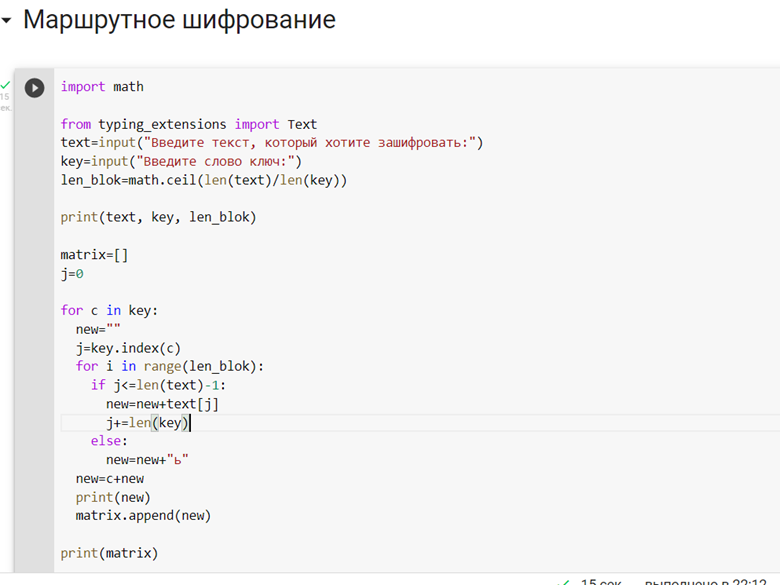
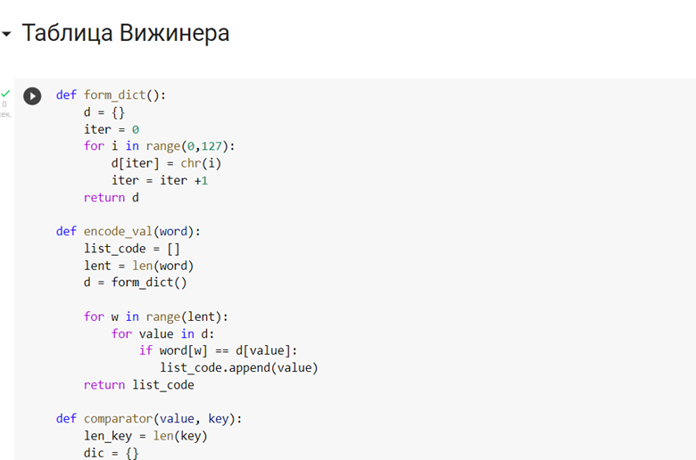
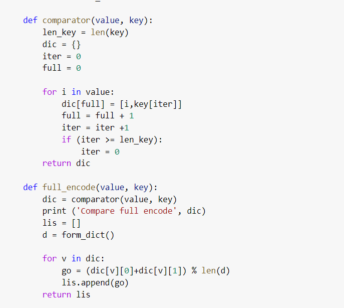
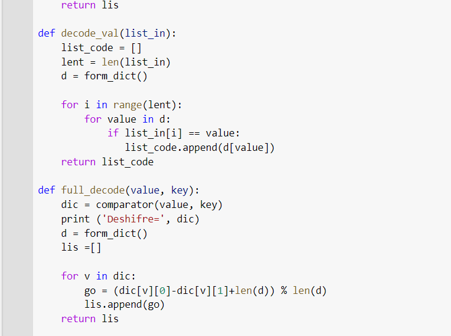
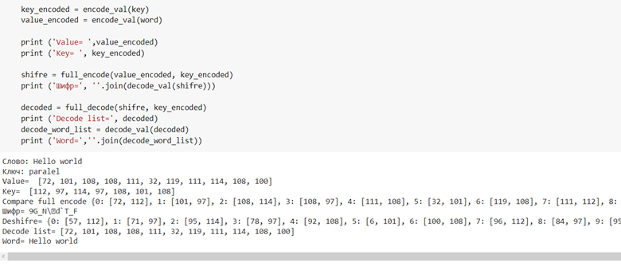

---
## Front matter
lang: ru-RU
title: Лабораторная работа №2
author: |
	Пак Мария  \inst{1}
	
institute: |
	\inst{1}RUDN University, Moscow, Russian Federation
	
date: 17.9.2022 Moscow, Russia

## Formatting
toc: false
slide_level: 2
theme: metropolis
header-includes: 
 - \metroset{progressbar=frametitle,sectionpage=progressbar,numbering=fraction}
 - '\makeatletter'
 - '\beamer@ignorenonframefalse'
 - '\makeatother'
aspectratio: 43
section-titles: true

---

## Прагматика выполнения лабораторной работы

В целях освоения программы предмета "Математические основы безопасности" студенты должны разбираться в основных принципах шифрования и дешифрования текста. На примере Шифров перестановки можно понять логику шифрования важной информации в электронных устройствах и принципы защиты информации. Все это необходимо для повышения безопасности в системе при работе с персональными или корпоративными компьютерами.

## Цель выполнения лабораторной работы

Освоить на практике написание шифров простой замены. 

## Задачи выполнения лабораторной работы

1. Реализовать маршрутное шифрование.

2) Реализовать шифрование решеток.
2) Реализовать Таблицу Вижинера.

## Результаты выполнения лабораторной работы

1. Реализовала Маршрутное шифрование. 

   (рис. -@fig:001)
   { #fig:001 width=100% }

   У нас есть текст: нельзя недооценивать противника, и ключ- "пароль".  Текст мы используем без пробелов.
   
   

## Результаты выполнения лабораторной работы

2. Зашифровала текст с помощью маршрутного шифрования. 

   (рис. -@fig:002)
   { #fig:002 width=100% }  

 Текст разбивается на количество блоков = длине слова пароля. Чтобы все блоки были одинаковой длинны, мы заполняем оставшееся место мягким знаком. Далее, в первый блок мы записываем 0 символ текста и + каждый 6 символ.  К началу каждого блока приписываем одну букву слова пароля. И в конце мы сортируем блоки по алфавиту, использую для этого первую букву блока - букву слова пароля.

## Результаты выполнения лабораторной работы

3. Реализовала Шифр Виженера.

   (рис. -@fig:003)
   { #fig:003 width=100% }

Нам нужно создать словарь, для того чтобы шифровать символы. На скрине изображены 2 первые функции, с помощью которых можно представить тестовый символ английской раскладки в виде цифр (юникод раскладка поэтому 127 символов).

## Результаты выполнения лабораторной работы

4. Зашифровала символы с помощью шифра Виженера.

(рис. -@fig:003)
{ #fig:001 width=100% }

Далее мы к каждому символу и текста и слово-пароля подставляем цифру из нашего словаря. Комбинируем в новый словарь цифры шифра и цифры текста, повторяя заново цифры слово-пароля. В конце суммируем цифры и получаем новое значение, индекс которого и ищем в новом словаре - так получается шифротекст.

## Результаты выполнения лабораторной работы

5. Дешифровала символы с помощью таблицы Виженера.

   (рис. -@fig:001)(рис. -@fig:005)
   { #fig:001 width=100% }

   Используя примерно те же действия для дешифровки символов, только цифры шифротекста - цифры слова пароля +127. Тем самым получаем первоначальный текст.
   
   (рис. -@fig:006)
   
   { #fig:001 width=100% }

## Выводы

В ходе данной лабораторной работы, написала программы для шифров перестановки. Поняла принцип шифрования и освоила написание шифров на языке Python.

## {.standout}

Спасибо за внимание 