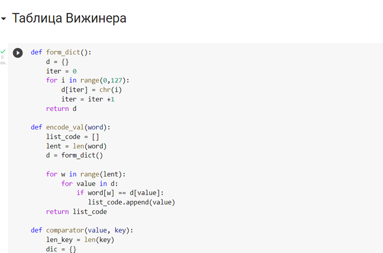
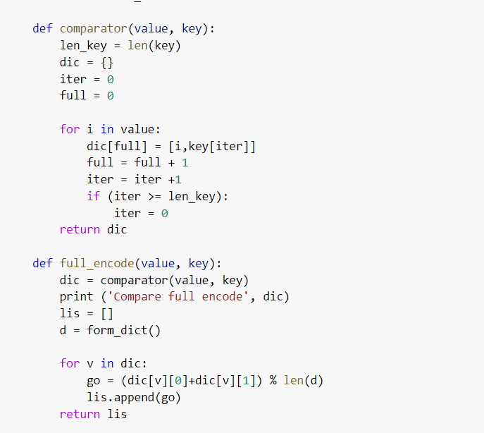

---
# Front matter 
lang: ru-RU
title: "Лабораторная работа № 2"
subtitle: "Шифры перестановки"
author: "Пак Мария НФИмд-02-22 10322225516"

# Formatting
toc-title: "Содержание"
toc: true # Table of contents
toc_depth: 2
lof: true # List of figures
lot: true # List of tables
fontsize: 12pt
linestretch: 1.5
papersize: a4paper
documentclass: scrreprt
polyglossia-lang: russian
polyglossia-otherlangs: english
mainfont: PT Serif
romanfont: PT Serif
sansfont: PT Sans
monofont: PT Mono
mainfontoptions: Ligatures=TeX
romanfontoptions: Ligatures=TeX
sansfontoptions: Ligatures=TeX,Scale=MatchLowercase
monofontoptions: Scale=MatchLowercase
indent: true
pdf-engine: lualatex
header-includes:
  - \linepenalty=10 # the penalty added to the badness of each line within a paragraph (no associated penalty node) Increasing the value makes tex try to have fewer lines in the paragraph.
  - \interlinepenalty=0 # value of the penalty (node) added after each line of a paragraph.
  - \hyphenpenalty=50 # the penalty for line breaking at an automatically inserted hyphen
  - \exhyphenpenalty=50 # the penalty for line breaking at an explicit hyphen
  - \binoppenalty=700 # the penalty for breaking a line at a binary operator
  - \relpenalty=500 # the penalty for breaking a line at a relation
  - \clubpenalty=150 # extra penalty for breaking after first line of a paragraph
  - \widowpenalty=150 # extra penalty for breaking before last line of a paragraph
  - \displaywidowpenalty=50 # extra penalty for breaking before last line before a display math
  - \brokenpenalty=100 # extra penalty for page breaking after a hyphenated line
  - \predisplaypenalty=10000 # penalty for breaking before a display
  - \postdisplaypenalty=0 # penalty for breaking after a display
  - \floatingpenalty = 20000 # penalty for splitting an insertion (can only be split footnote in standard LaTeX)
  - \raggedbottom # or \flushbottom
  - \usepackage{float} # keep figures where there are in the text
  - \floatplacement{figure}{H} # keep figures where there are in the text

---

# Лабораторная работа №1

[TOC]

## Цель работы
Освоить на практике написание шифров перестановки. Использовать методы маршрутного шифрования, таблицу Виженера и шифрование решеток.

## Задание

1. Реализовать маршрутное шифрование.
1. Реализовать шифрование решеток.
3. Реализовать Таблицу Виженера.

## Теоретическое введение

Маршрутное шифрование — это метод симметричного **шифрования**, в котором элементы исходного открытого текста меняют местами. Элементами текста могут быть отдельные символы (самый распространённый случай), пары букв, тройки букв, комбинирование этих случаев и так далее. Типичными примерами перестановки являются анаграммы.. [[1]](## Список литературы).

Шифровальная **решётка** — трафарет с прорезями-ячейками (из бумаги, картона или аналогичного материала), использовавшийся для шифрования открытого текста. Текст наносился на лист бумаги через такой трафарет по определённым правилам, и расшифровка текста была возможна только при наличии такого же трафарета.[[3]](## Список литературы)

**Шифр Виженера** (фр. Chiffre de Vigenère) — метод полиалфавитного шифрования буквенного текста с использованием ключевого слова [[2]](## Список литературы).

## Оборудование

Лабораторная работа выполнялась дома со следующими характеристиками техники: 

– Intel(R) Core(TM) i7-7700HQ CPU @ 2.80GHz 2.81GHz
– ОС Майкрософт Windows 10
– VirtualBox верс. 6.1.26

Код был написан на языке Python2.

Демонстрация работы кода проводилась в продукте Google Colaboratory.

# Выполнение лабораторной работы
 1. Реализовала маршрутное шифрование. 

      (рис. -@fig:001)
      { #fig:001 width=100% }

      У нас есть текст: нельзя недооценивать противника, и ключ- "пароль".  Текст мы используем без пробелов.

      2. Показала работу шифра. 

         (рис. -@fig:002)
         { #fig:002 width=100% }

      Если кратко пересказывать работу данного шифра, то текст разбивается на количество блоков = длине слова пароля. В данном случае это 6 блоков длиной в 5 символов. Чтобы все блоки были одинаковой длинны, мы заполняем оставшееся место мягким знаком. Далее, в первый блок мы записываем 0 символ текста и + каждый 6 символ. Во второй блок 1 и +6 символ и тд. К началу каждого блока приписываем одну букву слова пароля.

      И в конце мы сортируем блоки по алфавиту, использую для этого первую букву блока - букву слова пароля.

      На картинке видно, как в конце, после всех преобразований, мы получили шифротекст методом маршрутное шифрование.

      3. Реализовала Шифр Виженера.

         (рис. -@fig:003)
         { #fig:003 width=100% }

      В этом случае наш текс - Hello world и ключ - paralel. 

      Также нам нужно создать словарь, для того чтобы шифровать символы. На скрине изображены 2 первые функции, с помощью которых можно представить тестовый символ английской раскладки в виде цифр (юникод раскладка поэтому 127 символов).

      4. Зашифровала символы с помощью шифра Виженера.

(рис. -@fig:004)
{ #fig:001 width=100% }

Далее мы к каждому символу и текста и слово-пароля подставляем цифру из нашего словаря. Комбинируем в новый словарь цифры шифра и цифры текста, повторяя заново цифры слово-пароля. 

Далее мы суммируем цифру текста 72 с цифрой слова пароля 112  (72+112=184 % 127= 57), и делим на общее количество символов в словаря, оставляя остаток в качестве шифро-текста (57).

Проделываем данную операцию для всех символов.

5. Дешифровала символы.

(рис. -@fig:005)
{ #fig:001 width=100% }

Используя примерно те же действия для дешифровки символов, только цифры шифротекста - цифры слова пароля +127. Тем самым получаем первоначальный текст.

(рис. -@fig:006)

{ #fig:001 width=100% }

## Выводы
В ходе данной лабораторной работы, были реализованы разные виды шифров перестановки.

## Список литературы 

1. Шифры перестановки// Хабр URL: https://habr.com/ru/post/583616/ (дата обращения: 22.09.2022).
2. Лабораторная работа 2. Шифры перестановки. // Туис URL: https://esystem.rudn.ru/pluginfile.php/1198312/mod_resource/content/2/007-lab_crypto-gamma.pdf (дата обращения: 28.09.2022).
3. Простейшие методы шифрования с симметричным ключом// НОУ ИНТУТ URL: https://intuit.ru/studies/courses/691/547/lecture/12373?page=4 (дата обращения: 29.09.2022).

