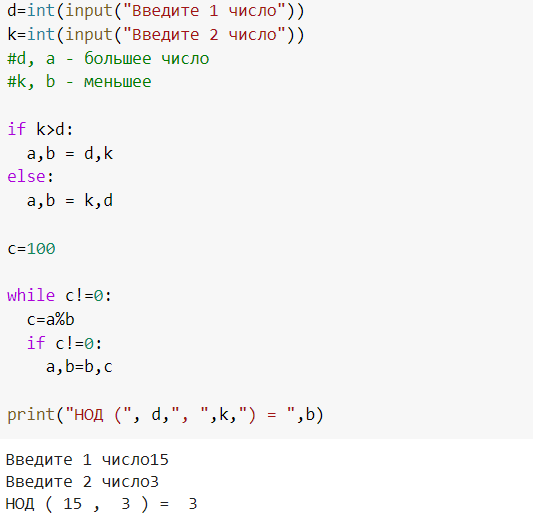
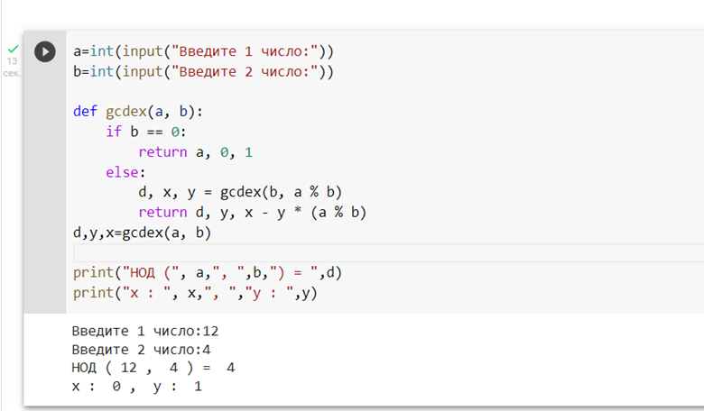

---
## Front matter
lang: ru-RU
title: Лабораторная работа №4 Алгоритм Евклида
author: |
	Пак Мария  \inst{1}
	
institute: |
	\inst{1}RUDN University, Moscow, Russian Federation
	
date: 01.10.2021 Moscow, Russia

## Formatting
toc: false
slide_level: 2
theme: metropolis
header-includes: 
 - \metroset{progressbar=frametitle,sectionpage=progressbar,numbering=fraction}
 - '\makeatletter'
 - '\beamer@ignorenonframefalse'
 - '\makeatother'
aspectratio: 43
section-titles: true

---

## Прагматика выполнения лабораторной работы

Студенты должны разбираться в методах шифрования и познакомиться способом шифрования текста гаммированию. Поэтому освоение и реализацию нахождения НОД разнообразными методами Евклида положительно скажется на будущее понимание процесса шифрования.

## Цель выполнения лабораторной работы

Реализовать с помощью программирования программы нахождения НОД, методами, описанными в задании к лабораторной работе №4.

## Задачи выполнения лабораторной работы

Разработать 4 программы, которые будут представлять из себя: 

1. Алгоритм Евклида. 
2. Расширенный алгоритм Евклида.
3. Бинарный алгоритм Евклида.
4. Расширенный Бинарный алгоритм Евклида.

## Результаты выполнения лабораторной работы

1. Реализовала программу поиска НОД методом алгоритма Евклида.

      (рис. -@fig:001)
      { #fig:001 width=100% }

      Основная суть алгоритма лежит в том, чтобы большее число делить на меньшее и сохранять остатки от деления для дальнейших операций. А самим НОД будет делитель в том случае, когда остатка от деления не останется. 

## Результаты выполнения лабораторной работы

2. Реализовала программу расширенного алгоритма Евклида.

     (рис. -@fig:003)
     { #fig:001 width=100% }
     
     Основное отличие расширенного алгоритма заключается в поиске таких коэффициентов x и y, которые удовлетворяют условию x*a+y*b=d, где d= делитель.

## Результаты выполнения лабораторной работы

3. Реализовала бинарный алгоритм Евклида. (рис. -@fig:005)
     { #fig:001 width=100% }

От стандартного алгоритма его отличает использование в коде приемов со свойствами НОД. И так как бинарный алгоритм в основном использует манипуляции с четными числами, то данные вычисления проходят намного быстрее в компьютере из-за его двоичного кода.

## Результаты выполнения лабораторной работы

4. Реализовала расширенный алгоритм Евклида с бинарными вычислениями. 

(рис. -@fig:003)
{ #fig:001 width=100% }

Являет собой квинтэссенцию всех пунктов выше, так как включает в себя и нахождение коэффициентов x и y для уравнения  x*a+y*b=d, и задействованные свойства НОД с бинарными вычислениями. Убойная штука, всем советую.

## Вывод

Освоен на практике написание всех этих горемычных пунктов. Познала Дзен, ушла в буддизм.

## {.standout}Спасибо за внимание 
