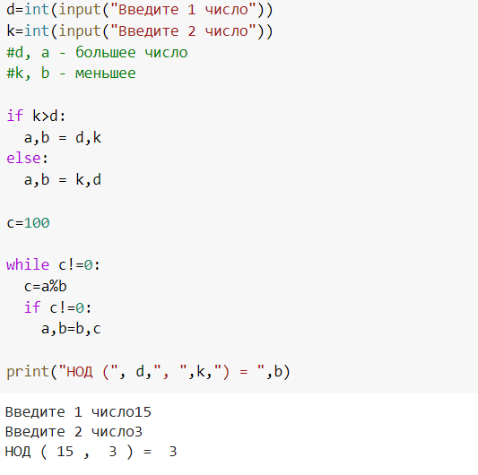
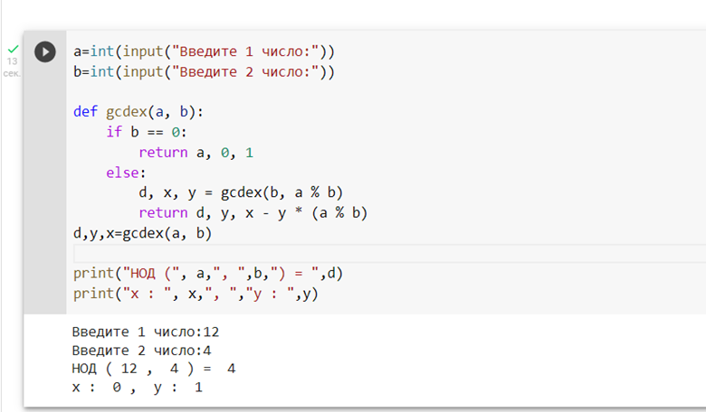
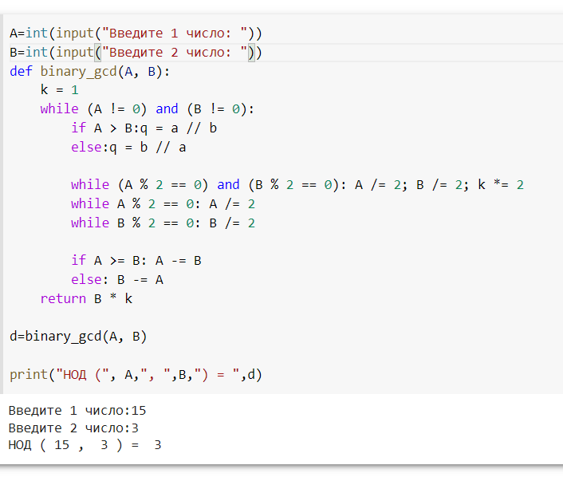
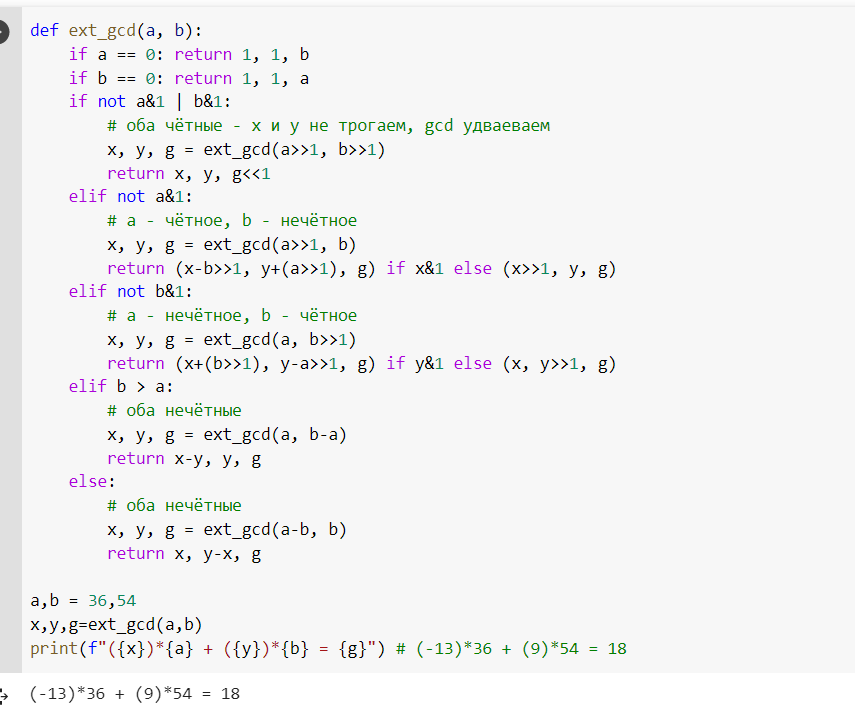

---
# Front matter 
lang: ru-RU
title: "Лабораторная работа №4"
subtitle: "Алгоритмы Евклида"
author: "Пак Мария НФИ-02-22"

# Formatting
toc-title: "Содержание"
toc: true # Table of contents
toc_depth: 2
lof: true # List of figures
lot: true # List of tables
fontsize: 12pt
linestretch: 1.5
papersize: a4paper
documentclass: scrreprt
polyglossia-lang: russian
polyglossia-otherlangs: english
mainfont: PT Serif
romanfont: PT Serif
sansfont: PT Sans
monofont: PT Mono
mainfontoptions: Ligatures=TeX
romanfontoptions: Ligatures=TeX
sansfontoptions: Ligatures=TeX,Scale=MatchLowercase
monofontoptions: Scale=MatchLowercase
indent: true
pdf-engine: lualatex
header-includes:
  - \linepenalty=10 # the penalty added to the badness of each line within a paragraph (no associated penalty node) Increasing the value makes tex try to have fewer lines in the paragraph.
  - \interlinepenalty=0 # value of the penalty (node) added after each line of a paragraph.
  - \hyphenpenalty=50 # the penalty for line breaking at an automatically inserted hyphen
  - \exhyphenpenalty=50 # the penalty for line breaking at an explicit hyphen
  - \binoppenalty=700 # the penalty for breaking a line at a binary operator
  - \relpenalty=500 # the penalty for breaking a line at a relation
  - \clubpenalty=150 # extra penalty for breaking after first line of a paragraph
  - \widowpenalty=150 # extra penalty for breaking before last line of a paragraph
  - \displaywidowpenalty=50 # extra penalty for breaking before last line before a display math
  - \brokenpenalty=100 # extra penalty for page breaking after a hyphenated line
  - \predisplaypenalty=10000 # penalty for breaking before a display
  - \postdisplaypenalty=0 # penalty for breaking after a display
  - \floatingpenalty = 20000 # penalty for splitting an insertion (can only be split footnote in standard LaTeX)
  - \raggedbottom # or \flushbottom
  - \usepackage{float} # keep figures where there are in the text
  - \floatplacement{figure}{H} # keep figures where there are in the text

---

# Лабораторная работа №4

[TOC]

## Цель работы
Освоить на практике реализацию нахождения НОД разнообразными методами Евклида.

## Задание

Реализовать с помощью программирования программы нахождения НОД, методами, описанными в задании к лабораторной работе №4.

## Теоретическое введение

Эффективный алгоритм для нахождения наибольшего общего делителя двух целых чисел. Алгоритм назван в честь греческого математика Евклида, который впервые описал его в VII и X книгах «Начал». Это один из старейших численных алгоритмов, используемых в наше время. [[1]](## Список литературы).

Аббревиатура НОД расшифровывается как «наибольший общий делитель». Наибольший общий делитель — делитель, который делит без остатка два числа, при этом сам делится без остатка на любой другой делитель исходных двух чисел. То есть это самое большое число, на которое без остатка можно разделить пару чисел, для которых подбирается НОД.[[2]](## Список литературы)

Суть алгоритма заключается в формировании новой пары чисел из меньшего и разницы между большим и меньшим элементом. Процесс, состоящий из арифметических операций, повторяется до тех пор, пока числа не будут равны друг другу. Первоначально инструкция создавалась для натуральных чисел и геометрических величин. Однако в XIX веке ее расширили и стали применять для других объектов: целых чисел Гаусса и многочленов с одной переменной (полиномов).[[3]](## Список литературы).

## Оборудование

Лабораторная работа выполнялась дома со следующими характеристиками техники: 

– Intel(R) Core(TM) i7-7700HQ CPU @ 2.80GHz 2.81GHz
– ОС Майкрософт Windows 10
– VirtualBox верс. 6.1.26

# Выполнение лабораторной работы
 1. Написала программу для простого алгоритма Евклида.

      (рис. -@fig:001)
      { #fig:001 width=100% }

      Первоначально мы вводим 2 числа для поиска НОД. Мы ищем большое число, если два числа не равны. Далее мы делим большее число на меньшее и остаток от деление записываем в новую переменную(если он есть). Теперь как делимое мы записываем прошлый делитель - a=b, а как делитель новый мы записываем остаток - b=c. И так продолжается, пока при делении двух новых чисел не останется остатка от деления. Когда такое произойдет, мы запишем как наибольший общий делитель (НОД) число, которое было последним без остаточным делителем b, при котором c==0.  

      2. Реализовала программу для расширенного алгоритма Евклида. 

         (рис. -@fig:002)
         { #fig:002 width=100% }

      Он отличается от обычного алгоритма тем, что ищет также дополнительные х и y, которые соответствовали бы условию a*x+b*y=d, где d - наибольший общий делитель. Это рекурсивный алгоритм, где условием выхода из цикла является b=0, в таком случае функция возвращает d =a, x=1, y=0. 

      На слайде можно увидеть, как если с найденными числами по алгоритму составить уравнение a*x+b*y=d, то мы получим 0+4=4, что соответствует верному решению

      3. Реализовала бинарный алгоритм Евклида.

         (рис. -@fig:003)
         { #fig:003 width=100% }

      

      Бинарный алгоритм Евклида также как и обычный ищет НОД методом остатка от деления, но также использует одно из свойств НОД. В данном случае свойство НОД(2*a,2*b)=2НОД(a,b). И даже если одно из чисел нечетное, то можно использовать свойство НОД(a,2*b)=НОД(a,b), так как двойка все равно не попадет в результирующее НОД. И последнее используемое свойство если a>b НОД (a,b)=НОД(a-b,b).

      
      
      Также этот алгоритм занимает меньше времени на обработку компьютером, так как процессорам проще проделывать операции деления и умножения на 2 из-за двоичного кода.
      
      4.Реализовала бинарный расширенный алгоритм Евклида.
      
      (рис. -@fig:004)
      { #fig:004 width=100% }
      
      Этот алгоритм представляет собой рекурсионный бинарный алгоритм, но с дополнительным вычислением x и y, как в пункте 2.
      
      По выводу данной программы, можно сделать вывод, что программа работает верно.

## Выводы
Освоила на практике написание 4 разных вариантов реализации кода для нахождения НОД алгоритмами Еклида.

## Список литературы 

1. Алгоритм Евклида // Wikipedia URL: https://ru.wikipedia.org/wiki/%D0%90%D0%BB%D0%B3%D0%BE%D1%80%D0%B8%D1%82%D0%BC_%D0%95%D0%B2%D0%BA%D0%BB%D0%B8%D0%B4%D0%B0 (дата обращения: 24.12.2021).
2. Методы нахождения НОД // ФоксФОРД URL: https://foxford.ru/wiki/matematika/algoritm-evklida (дата обращения: 25.12.2021).
3. НОД Евклида // Наука клубТ URL:  https://nauka.club/matematika/algoritm-evklida.html (дата обращения: 27.10.2021).

