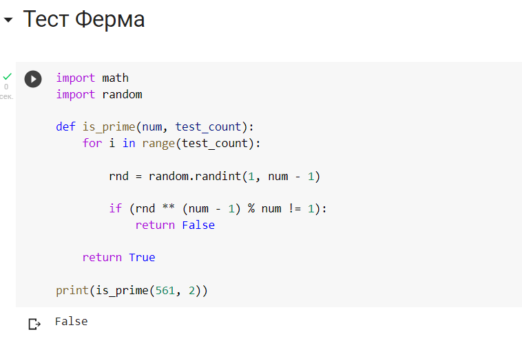
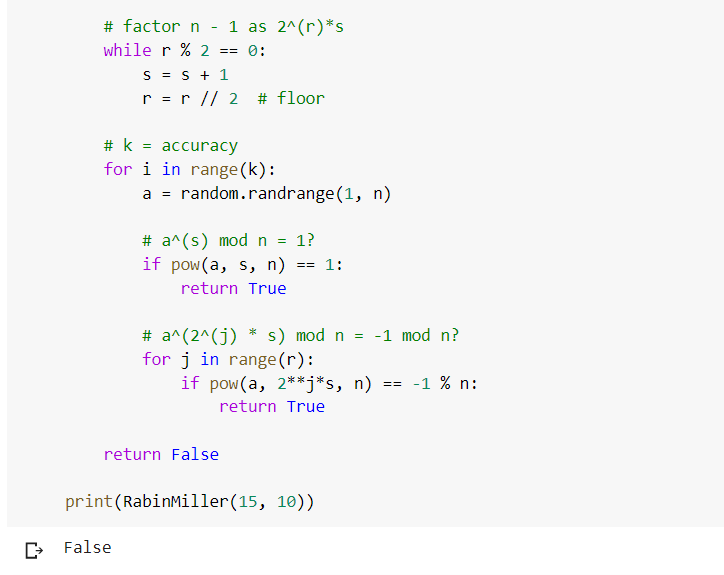
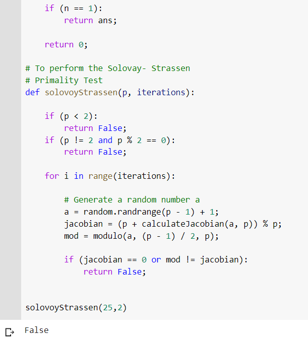

---
## Front matter
lang: ru-RU
title: Лабораторная работа №5 Вероятностные алгоритмы проверки чисел на простоту
author: |
	Пак Мария  \inst{1}
	
institute: |
	\inst{1}RUDN University, Moscow, Russian Federation
	
date: 12.11.2023 Moscow, Russia

## Formatting
toc: false
slide_level: 2
theme: metropolis
header-includes: 
 - \metroset{progressbar=frametitle,sectionpage=progressbar,numbering=fraction}
 - '\makeatletter'
 - '\beamer@ignorenonframefalse'
 - '\makeatother'
aspectratio: 43
section-titles: true

---

## Прагматика выполнения лабораторной работы

Студенты должны разбираться в методах шифрования. Поэтому освоение и реализация нахождения простых чисел разнообразными методами положительно скажется на будущее понимание процесса шифрования.

## Цель выполнения лабораторной работы

Реализовать с помощью программирования программы определяющие отношение к составным или простым числам, методами, описанными в задании к лабораторной работе №5.

## Задачи выполнения лабораторной работы

Разработать программы, которые будут представлять из себя: 

1. Программа повторяющая тест Ферма. 
2. Программа повторяющая тест Соловея-Штрассена  (алгоритм Якоби будет его частью)
3. Тест Миллера-Рабина

## Результаты выполнения лабораторной работы

1. Реализовала программу определения простоты чисел по алгоритму Теста Ферма.

      (рис. -@fig:001)
      { #fig:001 width=100% }

      Основная суть алгоритма лежит в том, чтобы сравнить число n (определяемое), c произвольным числом а (1<a<n-1). 
      
      Как видно на слайде, алгоритм в данном случае верно определяет, что число составное.

## Результаты выполнения лабораторной работы

2. Реализовала программу Миллера-Рабина.

     (рис. -@fig:003)
     { #fig:001 width=100% }
     
     Тест Миллера — Рабина, наряду с тестом Ферма и тестом Соловея — Штрассена, позволяет эффективно определить, является ли данное число составным. Однако, с его помощью нельзя строго доказать простоту числа. Тем не менее тест Миллера — Рабина часто используется в криптографии для получения больших случайных простых чисел.
     
     Как мы видим, здесь алгоритм также верно определил, что цифра 15 является составным числом.

## Результаты выполнения лабораторной работы

3. Реализовала алгоритм Соловея-Штрассена. (рис. -@fig:005)
     { #fig:001 width=100% }

Тест всегда корректно определяет, что простое число является простым, но для составных чисел с некоторой вероятностью он может дать неверный ответ. Основное преимущество теста заключается в том, что он, в отличие от теста Ферма, распознает числа Кармайкла как составные. Также в этом алгоритме рассчитывается число Якоби, как часть программы.

Как мы видим, тут также алгоритм верно определил, что число является составным.

## Вывод

Освоила на практике написание алгоритмов распознавания простых чисел.

## {.standout}Спасибо за внимание 
