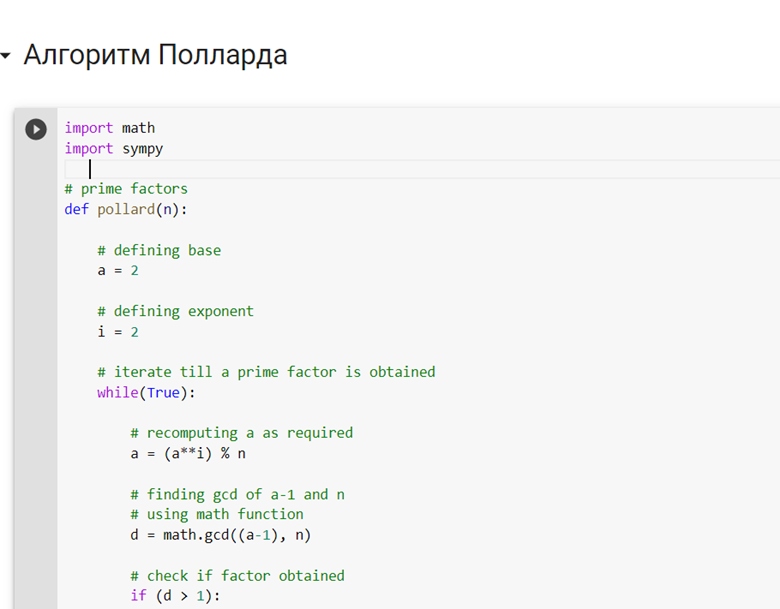
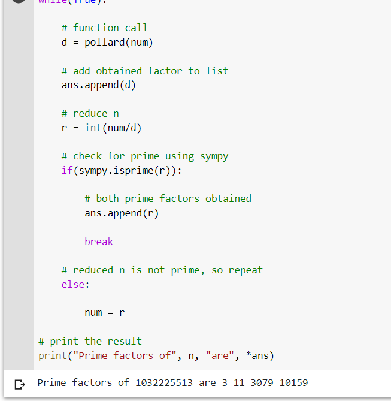

---
## Front matter
lang: ru-RU
title: Лабораторная работа №5 Вероятностные алгоритмы проверки чисел на простоту
author: |
	Пак Мария  \inst{1}
	
institute: |
	\inst{1}RUDN University, Moscow, Russian Federation
	
date: 12.11.2023 Moscow, Russia

## Formatting
toc: false
slide_level: 2
theme: metropolis
header-includes: 
 - \metroset{progressbar=frametitle,sectionpage=progressbar,numbering=fraction}
 - '\makeatletter'
 - '\beamer@ignorenonframefalse'
 - '\makeatother'
aspectratio: 43
section-titles: true

---

## Прагматика выполнения лабораторной работы

Студенты должны разбираться в методах шифрования. Поэтому освоение и реализации нахождения простых множителей разнообразными методами положительно скажется на будущее понимание процесса шифрования.

## Цель выполнения лабораторной работы

Реализовать с помощью программирования метод поиска простых множителей, методами, описанными в задании к лабораторной работе №6.

## Задачи выполнения лабораторной работы

Разработать код программы, который будут представлять из себя: 

1. Алгоритм Полларда. 

## Результаты выполнения лабораторной работы

1. Реализовала программу по Алгоритму Полларда.

      (рис. -@fig:001)
      { #fig:001 width=100% }

      Основная суть алгоритма лежит в том, чтобы найти для числа n разложение на простые множители. Для работы данного алгоритма, число n должно быть обязательно нечетное, иначе мы получим зацикливание. Алгоритм Полларда представляет из себя нахождение не всех простых множителей, а только нетривиальных (всех, кроме 1 и самого n)/
      

## Результаты выполнения лабораторной работы

2. Опробовала программный код на числе 1032225513.

     (рис. -@fig:003)
     { #fig:001 width=100% }
     
     Я хотела ввести номер своего студенческого, но, к сожалению, он четный((. Поэтому я выбрала число, близкое к нему. По итогу выполнений цикла (проверки всех цифр от 2 до n-1), программа выдала список чисел. Их перемножение снова дает нам мое первоначальное число.
     

## Вывод

Освоила на практике написание алгоритмов разложения на простые числа.

## {.standout}Спасибо за внимание 
